# Overview.md
# Overview

> **Relevant source files**
> * [README.md](https://github.com/hjsdjko/huochpiaodingpiao/blob/2f69da4e/README.md)
> * [pom.xml](https://github.com/hjsdjko/huochpiaodingpiao/blob/2f69da4e/pom.xml)

本页面提供了关于火车票预订系统（"huochpiaodingpiao"）的全面介绍，这是一个旨在简化火车票预订的全栈应用。本文档概述了系统的用途、架构和核心组件。如需了解系统特定方面的详细信息，请参阅其对应的维基页面（见[系统架构](/hjsdjko/huochpiaodingpiao/2-system-architecture)）。

## Purpose and Scope

火车票预订系统是一个完整的基于网络的平台，允许用户搜索列车时刻表、预订车票和管理预订。该系统通过用户账户余额处理用户注册、认证、列车时刻表管理、座位分配和支付处理。

Sources: [pom.xml L15-L16](https://github.com/hjsdjko/huochpiaodingpiao/blob/2f69da4e/pom.xml#L15-L16)

 [README.md L32-L41](https://github.com/hjsdjko/huochpiaodingpiao/blob/2f69da4e/README.md#L32-L41)

## System Architecture

火车票预订系统遵循三层架构，表示层、业务逻辑层和数据访问层之间有明确的分离。

### High-Level Architecture

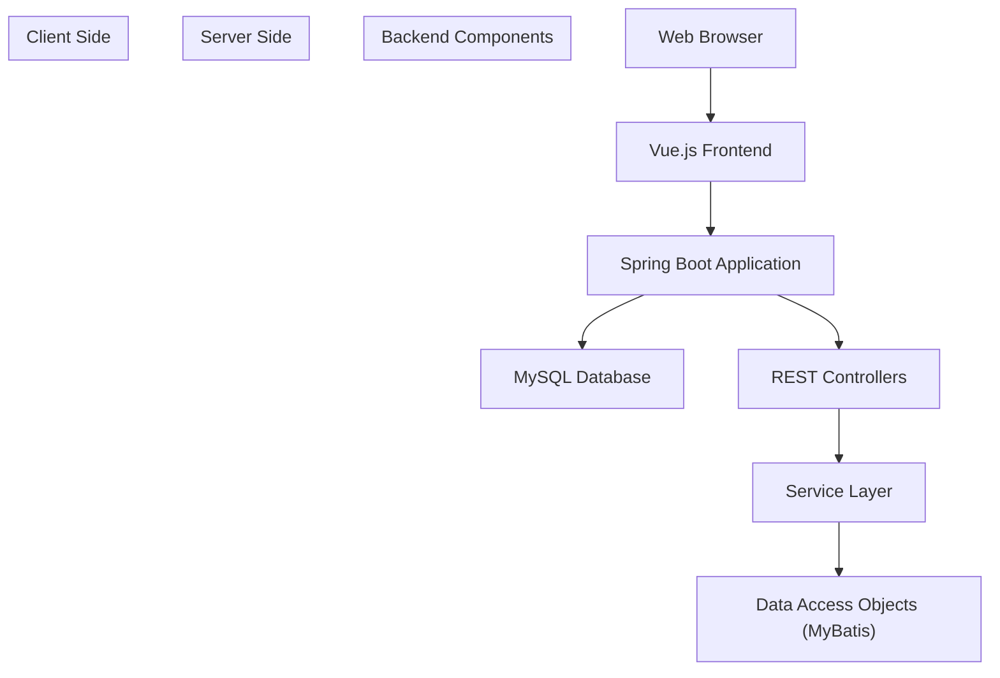

**Technology Stack:**

* **前端**: HTML, JavaScript, CSS, jQuery, Vue.js
**后端**: Spring Boot 2.2.2, MyBatis, MyBatis-Plus
* **Database**: MySQL
* **环境**: JDK 1.8+, Maven

Sources: [README.md L36-L40](https://github.com/hjsdjko/huochpiaodingpiao/blob/2f69da4e/README.md#L36-L40)

 [pom.xml L6-L9](https://github.com/hjsdjko/huochpiaodingpiao/blob/2f69da4e/pom.xml#L6-L9)

 [pom.xml L25-L72](https://github.com/hjsdjko/huochpiaodingpiao/blob/2f69da4e/pom.xml#L25-L72)

## Core Features

1. **用户管理**：注册，认证，和资料管理
2. **列车时刻表管理**：添加、更新和检索列车时刻表
3. **票务预订**：座位选择与预订流程
4. **订单管理**：创建和管理票务订单
5. **支付处理**：管理用户账户余额用于购票
6. **用户反馈**：用户沟通的消息系统

Sources: [pom.xml L15-L16](https://github.com/hjsdjko/huochpiaodingpiao/blob/2f69da4e/pom.xml#L15-L16)

核心实体和关系

系统围绕多个关键实体构建，这些实体构成了业务领域的基础：

```
#mermaid-c53jfomvev4{font-family:ui-sans-serif,-apple-system,system-ui,Segoe UI,Helvetica;font-size:16px;fill:#333;}@keyframes edge-animation-frame{from{stroke-dashoffset:0;}}@keyframes dash{to{stroke-dashoffset:0;}}#mermaid-c53jfomvev4 .edge-animation-slow{stroke-dasharray:9,5!important;stroke-dashoffset:900;animation:dash 50s linear infinite;stroke-linecap:round;}#mermaid-c53jfomvev4 .edge-animation-fast{stroke-dasharray:9,5!important;stroke-dashoffset:900;animation:dash 20s linear infinite;stroke-linecap:round;}#mermaid-c53jfomvev4 .error-icon{fill:#dddddd;}#mermaid-c53jfomvev4 .error-text{fill:#222222;stroke:#222222;}#mermaid-c53jfomvev4 .edge-thickness-normal{stroke-width:1px;}#mermaid-c53jfomvev4 .edge-thickness-thick{stroke-width:3.5px;}#mermaid-c53jfomvev4 .edge-pattern-solid{stroke-dasharray:0;}#mermaid-c53jfomvev4 .edge-thickness-invisible{stroke-width:0;fill:none;}#mermaid-c53jfomvev4 .edge-pattern-dashed{stroke-dasharray:3;}#mermaid-c53jfomvev4 .edge-pattern-dotted{stroke-dasharray:2;}#mermaid-c53jfomvev4 .marker{fill:#999;stroke:#999;}#mermaid-c53jfomvev4 .marker.cross{stroke:#999;}#mermaid-c53jfomvev4 svg{font-family:ui-sans-serif,-apple-system,system-ui,Segoe UI,Helvetica;font-size:16px;}#mermaid-c53jfomvev4 p{margin:0;}#mermaid-c53jfomvev4 .entityBox{fill:#ffffff;stroke:#dddddd;}#mermaid-c53jfomvev4 .relationshipLabelBox{fill:#dddddd;opacity:0.7;background-color:#dddddd;}#mermaid-c53jfomvev4 .relationshipLabelBox rect{opacity:0.5;}#mermaid-c53jfomvev4 .labelBkg{background-color:rgba(221, 221, 221, 0.5);}#mermaid-c53jfomvev4 .edgeLabel .label{fill:#dddddd;font-size:14px;}#mermaid-c53jfomvev4 .label{font-family:ui-sans-serif,-apple-system,system-ui,Segoe UI,Helvetica;color:#333;}#mermaid-c53jfomvev4 .edge-pattern-dashed{stroke-dasharray:8,8;}#mermaid-c53jfomvev4 .node rect,#mermaid-c53jfomvev4 .node circle,#mermaid-c53jfomvev4 .node ellipse,#mermaid-c53jfomvev4 .node polygon{fill:#ffffff;stroke:#dddddd;stroke-width:1px;}#mermaid-c53jfomvev4 .relationshipLine{stroke:#999;stroke-width:1;fill:none;}#mermaid-c53jfomvev4 .marker{fill:none!important;stroke:#999!important;stroke-width:1;}#mermaid-c53jfomvev4 :root{--mermaid-font-family:"trebuchet ms",verdana,arial,sans-serif;}placesfulfillsYONGHUintidPrimary KeystringusernameUser login namestringpasswordUser passwordfloatnewMoneyAccount balancestringyonghuPhoneContact numberstringyonghuIdNumberID documentintyonghuDeleteSoft delete flagdatecreateTimeCreation timestampCHECI_ORDERintidPrimary KeystringcheciOrderUuidNumberOrder numberintcheciIdTrain referenceintyonghuIdUser referencedoublecheciOrderTruePriceFinal priceintcheciOrderTypesOrder statusintbuySectionNumberBooked section numberstringbuyZuoweiNumberBooked seat numberdatebuyZuoweiTimeBooking timedatecreateTimeCreation timestampCHECIintidPrimary KeystringcheciNameTrain name/numberstringcheciPhotoTrain imageintcheciTypesTrain categorystringcheciNewMoneyTicket pricestringcheciChufadiDeparture stationstringcheciMudidiDestination stationdatecheciTimeDeparture timeintsectionNumberNumber of sectionsintzuoweiNumberSeats per sectionintshangxiaTypesDirection typeintcheciDeleteSoft delete flagstringcheciContentAdditional detailsdatecreateTimeCreation timestamp
```

**Entity Descriptions:**

**用户（User）**：表示可以搜索和预订票的系统用户
* **CHECI（列车）**：表示包含出发/目的地信息的列车时刻表
* **CHECI_ORDER (列车订单)**：表示连接用户和列车的预订交易

如需更详细的解释，请参见 [核心实体](/hjsdjko/huochpiaodingpiao/3-core-entities)。

资料来源：该图表基于提供的综合系统分析

## Component Architecture

该应用程序遵循标准的控制器-服务-数据访问对象模式：

| Layer | Purpose | Key Components |
| --- | --- | --- |
| Controller | Handles HTTP requests and API endpoints | CheciController, YonghuController, CheciOrderController |
| Service | Contains business logic | CheciService, YonghuService, CheciOrderService |
| DAO | Data access layer interfacing with database | CheciDao, YonghuDao, CheciOrderDao |

控制器负责处理Web请求，将处理委托给实现业务规则的服务，并通过DAO进行数据的持久化和检索。

来源：架构信息来源于提供的系统图

## Authentication and Authorization

系统实现了基于令牌的认证和基于角色的访问控制。认证通过拦截器处理，这些拦截器在允许访问受保护的资源之前验证令牌并检查用户权限。

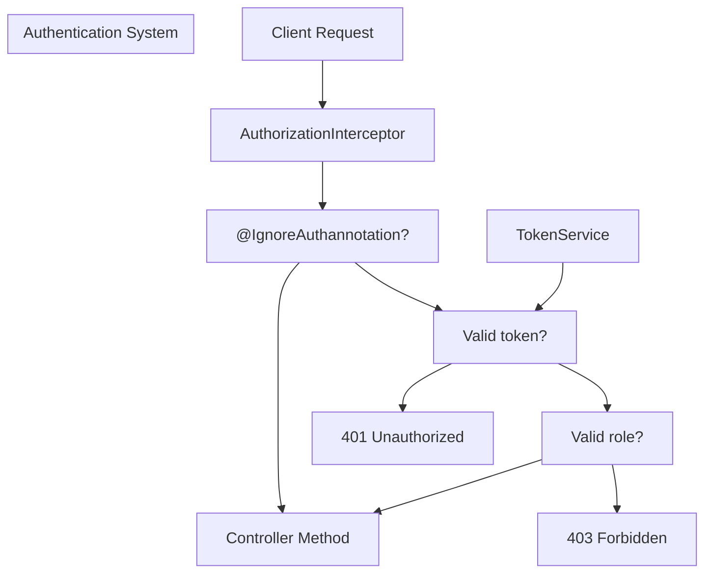

如需了解认证系统的更多细节，请参见 [认证系统](/hjsdjko/huochpiaodingpiao/4-authentication-system)。

Sources: [pom.xml L57-L61](https://github.com/hjsdjko/huochpiaodingpiao/blob/2f69da4e/pom.xml#L57-L61)

- Shiro依赖项，指示安全框架

## User Interaction Flow

用户预订火车票的典型流程如下：

1. 用户注册或登录以获取认证令牌
2. 用户根据出发/目的地车站和日期搜索可用的火车
3. 用户选择一列火车并选择座位
4. 系统验证用户账户余额和座位可用性。
5. 用户确认预订，并系统生成订单。
6. 用户账户余额被更新，并开具票据。

如需了解预订流程的更多信息，请参见 [购票流程](/hjsdjko/huochpiaodingpiao/7-ticket-booking-process)。

来源：此流程源自提供的预订流程序列图。

## System Configuration

系统采用多种配置方法：

1. **属性文件**：标准的Spring Boot配置
2. **数据库配置**：存储在数据库中的动态系统设置
3. **字典系统**：查找下拉选项和枚举的值

基于字典的配置允许在不修改代码的情况下灵活管理系统选项。

如需了解配置选项的更多信息，请参见 [配置系统](/hjsdjko/huochpiaodingpiao/2.1-configuration-system) 和 [字典系统](/hjsdjko/huochpiaodingpiao/2.2-dictionary-system)。

Sources: [pom.xml L64-L72](https://github.com/hjsdjko/huochpiaodingpiao/blob/2f69da4e/pom.xml#L64-L72)

- MyBatis-Plus 依赖项，建议使用高级 ORM 配置

## Additional Technical Features

* **软删除实现**：记录被标记为已删除，而不是被物理删除
* **MyBatis-Plus集成**：增强的数据库操作，简化的CRUD，以及分页支持
* **RESTful API设计**: 标准化的API端点，便于前端集成
* **基于令牌的安全机制**：安全的身份验证机制

Sources: [pom.xml L64-L72](https://github.com/hjsdjko/huochpiaodingpiao/blob/2f69da4e/pom.xml#L64-L72)

- MyBatis-Plus 依赖项，表明增强的 ORM 功能

## Conclusion

火车票预订系统是一个全面的解决方案，用于管理列车时刻表、用户账户和票务预订。它遵循现代软件架构原则，实现清晰的职责分离，并借助Spring Boot和Vue.js等流行框架，提供稳健的用户体验。

对于特定系统组件的详细文档，请参考本Wiki中的相应部分。

# System-Architecture.md
# System Architecture

> **Relevant source files**
> * [README.md](https://github.com/hjsdjko/huochpiaodingpiao/blob/2f69da4e/README.md)
> * [pom.xml](https://github.com/hjsdjko/huochpiaodingpiao/blob/2f69da4e/pom.xml)
> * [src/main/java/com/config/InterceptorConfig.java](https://github.com/hjsdjko/huochpiaodingpiao/blob/2f69da4e/src/main/java/com/config/InterceptorConfig.java)
> * [src/main/java/com/config/MybatisPlusConfig.java](https://github.com/hjsdjko/huochpiaodingpiao/blob/2f69da4e/src/main/java/com/config/MybatisPlusConfig.java)

## Purpose and Scope

本文档描述了火车票预订系统（"huochpiaodingpiao"）的整体架构。它涵盖了系统高层次设计、组件组织、交互模式和技术实现细节。本文档旨在作为开发人员的指南，帮助其理解系统中各个组件如何协同工作以及数据在应用程序中的流动方式。

关于配置管理的详细信息，请参阅[配置系统](/hjsdjko/huochpiaodingpiao/2.1-configuration-system)。关于用于查找值的字典系统的信息，请参阅[字典系统](/hjsdjko/huochpiaodingpiao/2.2-dictionary-system)。

## Overview

火车票预订系统基于传统的多层架构构建，具有明确的职责分离。该系统旨在为火车票预订操作提供一个可扩展且易于维护的解决方案。

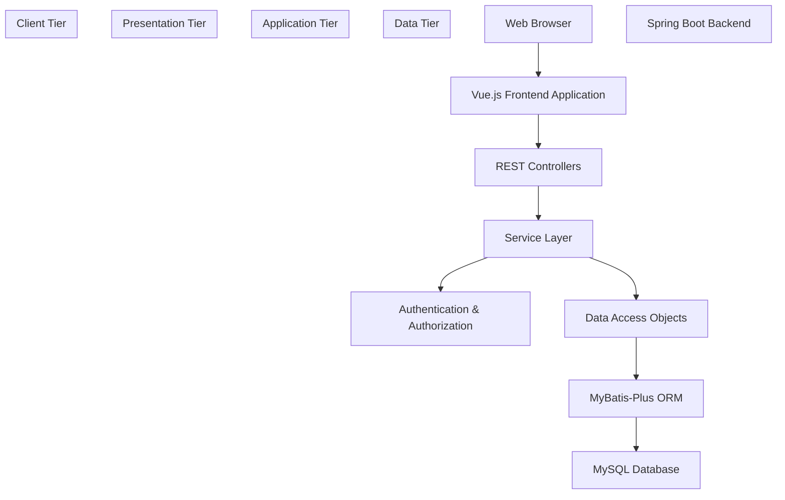

Sources: [README.md L34-L40](https://github.com/hjsdjko/huochpiaodingpiao/blob/2f69da4e/README.md#L34-L40)

 [pom.xml L1-L182](https://github.com/hjsdjko/huochpiaodingpiao/blob/2f69da4e/pom.xml#L1-L182)

## Technology Stack

系统采用以下技术：

| Layer | Technologies |
| --- | --- |
| Frontend | HTML, JavaScript, CSS, jQuery, Vue.js |
| Backend | Spring Boot, MyBatis-Plus |
| Database | MySQL |
| Build Tool | Maven |
| Runtime Environment | JDK 1.8+ |

Sources: [README.md L34-L40](https://github.com/hjsdjko/huochpiaodingpiao/blob/2f69da4e/README.md#L34-L40)

 [pom.xml L12-L16](https://github.com/hjsdjko/huochpiaodingpiao/blob/2f69da4e/pom.xml#L12-L16)

## Backend Architecture

系统的后端使用Spring Boot实现，遵循多层架构模式，以促进关注点分离。

### Spring Boot Components

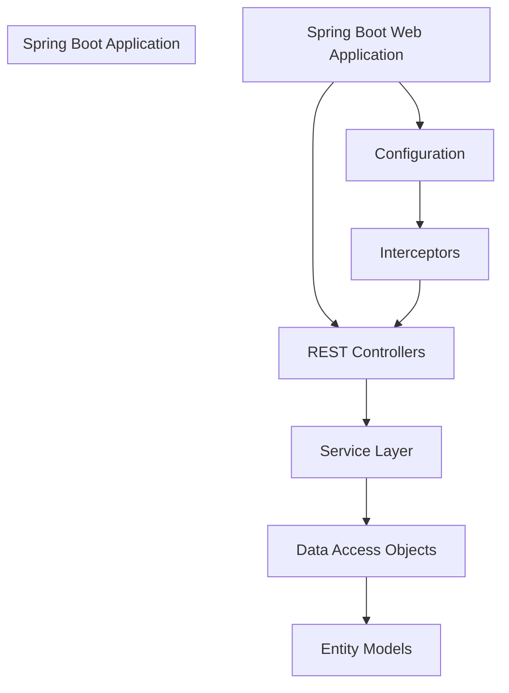

Sources: [pom.xml L24-L37](https://github.com/hjsdjko/huochpiaodingpiao/blob/2f69da4e/pom.xml#L24-L37)

 [src/main/java/com/config/InterceptorConfig.java L1-L39](https://github.com/hjsdjko/huochpiaodingpiao/blob/2f69da4e/src/main/java/com/config/InterceptorConfig.java#L1-L39)

### Controller-Service-DAO Pattern

系统采用标准的控制器-服务-数据访问对象模式，其中：

1. **控制器**：处理HTTP请求，处理输入数据，并返回响应
2. **服务**：包含业务逻辑并编排操作
3. **DAOs（数据访问对象）**：使用 MyBatis-Plus 处理数据库交互

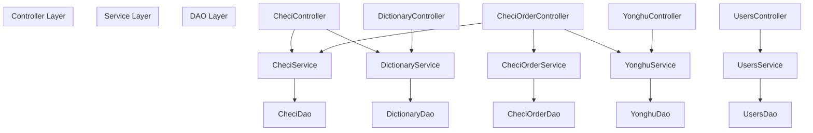

Sources: [pom.xml L63-L72](https://github.com/hjsdjko/huochpiaodingpiao/blob/2f69da4e/pom.xml#L63-L72)

## Data Access Layer

### MyBatis-Plus Integration

系统使用MyBatis-Plus作为ORM（对象关系映射）框架以简化数据库操作。MyBatis-Plus通过附加功能扩展了基础MyBatis功能，例如：

* Automatic CRUD operations
* Pagination support
* Query wrapping
* SQL injection prevention

MyBatis-Plus的配置在`MybatisPlusConfig`类中定义。

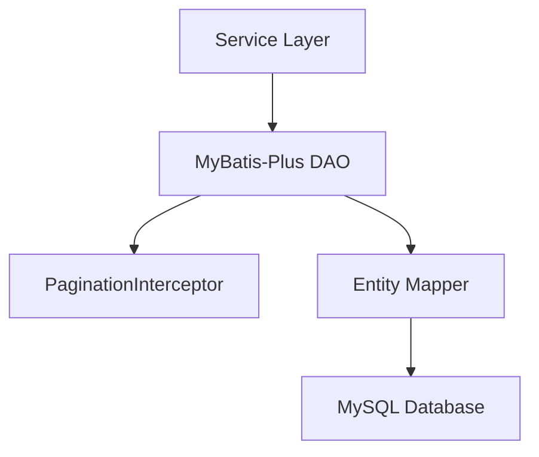

Sources: [src/main/java/com/config/MybatisPlusConfig.java L1-L24](https://github.com/hjsdjko/huochpiaodingpiao/blob/2f69da4e/src/main/java/com/config/MybatisPlusConfig.java#L1-L24)

 [pom.xml L63-L72](https://github.com/hjsdjko/huochpiaodingpiao/blob/2f69da4e/pom.xml#L63-L72)

### Entity Relationships

系统中的核心实体及其关系如下所示：

```
#mermaid-o9v1uudcp{font-family:ui-sans-serif,-apple-system,system-ui,Segoe UI,Helvetica;font-size:16px;fill:#333;}@keyframes edge-animation-frame{from{stroke-dashoffset:0;}}@keyframes dash{to{stroke-dashoffset:0;}}#mermaid-o9v1uudcp .edge-animation-slow{stroke-dasharray:9,5!important;stroke-dashoffset:900;animation:dash 50s linear infinite;stroke-linecap:round;}#mermaid-o9v1uudcp .edge-animation-fast{stroke-dasharray:9,5!important;stroke-dashoffset:900;animation:dash 20s linear infinite;stroke-linecap:round;}#mermaid-o9v1uudcp .error-icon{fill:#dddddd;}#mermaid-o9v1uudcp .error-text{fill:#222222;stroke:#222222;}#mermaid-o9v1uudcp .edge-thickness-normal{stroke-width:1px;}#mermaid-o9v1uudcp .edge-thickness-thick{stroke-width:3.5px;}#mermaid-o9v1uudcp .edge-pattern-solid{stroke-dasharray:0;}#mermaid-o9v1uudcp .edge-thickness-invisible{stroke-width:0;fill:none;}#mermaid-o9v1uudcp .edge-pattern-dashed{stroke-dasharray:3;}#mermaid-o9v1uudcp .edge-pattern-dotted{stroke-dasharray:2;}#mermaid-o9v1uudcp .marker{fill:#999;stroke:#999;}#mermaid-o9v1uudcp .marker.cross{stroke:#999;}#mermaid-o9v1uudcp svg{font-family:ui-sans-serif,-apple-system,system-ui,Segoe UI,Helvetica;font-size:16px;}#mermaid-o9v1uudcp p{margin:0;}#mermaid-o9v1uudcp .entityBox{fill:#ffffff;stroke:#dddddd;}#mermaid-o9v1uudcp .relationshipLabelBox{fill:#dddddd;opacity:0.7;background-color:#dddddd;}#mermaid-o9v1uudcp .relationshipLabelBox rect{opacity:0.5;}#mermaid-o9v1uudcp .labelBkg{background-color:rgba(221, 221, 221, 0.5);}#mermaid-o9v1uudcp .edgeLabel .label{fill:#dddddd;font-size:14px;}#mermaid-o9v1uudcp .label{font-family:ui-sans-serif,-apple-system,system-ui,Segoe UI,Helvetica;color:#333;}#mermaid-o9v1uudcp .edge-pattern-dashed{stroke-dasharray:8,8;}#mermaid-o9v1uudcp .node rect,#mermaid-o9v1uudcp .node circle,#mermaid-o9v1uudcp .node ellipse,#mermaid-o9v1uudcp .node polygon{fill:#ffffff;stroke:#dddddd;stroke-width:1px;}#mermaid-o9v1uudcp .relationshipLine{stroke:#999;stroke-width:1;fill:none;}#mermaid-o9v1uudcp .marker{fill:none!important;stroke:#999!important;stroke-width:1;}#mermaid-o9v1uudcp :root{--mermaid-font-family:"trebuchet ms",verdana,arial,sans-serif;}placesfulfillsYONGHUintidstringusernamestringpasswordfloatnewMoneystringyonghuPhonestringyonghuIdNumberintyonghuDeletedatecreateTimeCHECI_ORDERintidstringcheciOrderUuidNumberintcheciIdintyonghuIddoublecheciOrderTruePriceintcheciOrderTypesintbuySectionNumberstringbuyZuoweiNumberdatebuyZuoweiTimedateinsertTimedatecreateTimeCHECIintidstringcheciNamestringcheciPhotointcheciTypesstringcheciNewMoneystringcheciChufadistringcheciMudididatecheciTimeintsectionNumberintzuoweiNumberintshangxiaTypesintcheciDeletestringcheciContentdatecreateTime
```

## Authentication and Authorization

系统实现了基于令牌的认证和授权机制。这主要通过`AuthorizationInterceptor`处理，该拦截器拦截传入的请求并验证用户令牌。

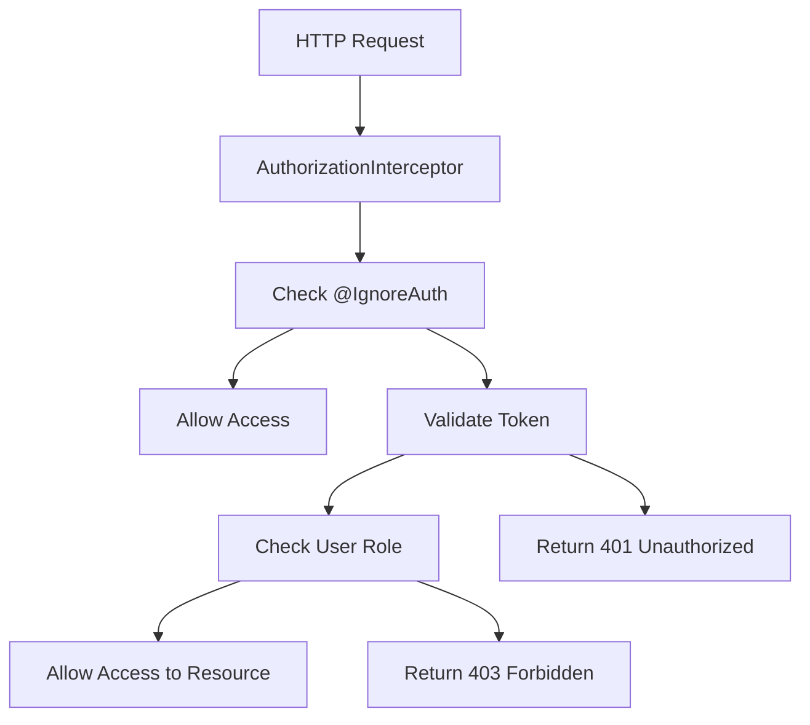

Sources: [src/main/java/com/config/InterceptorConfig.java L9-L17](https://github.com/hjsdjko/huochpiaodingpiao/blob/2f69da4e/src/main/java/com/config/InterceptorConfig.java#L9-L17)

## Request Processing Flow

下图说明了典型请求在系统中的流程。

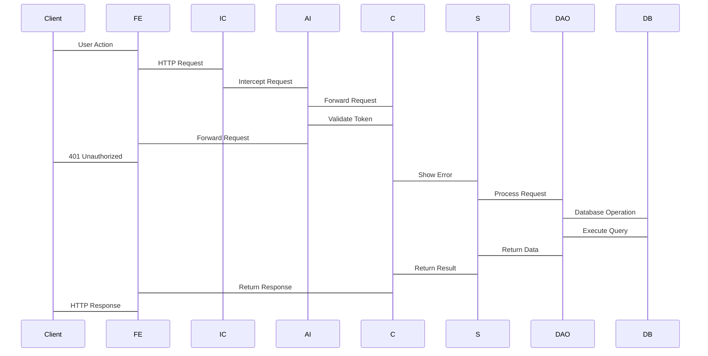

Sources: [src/main/java/com/config/InterceptorConfig.java L19-L23](https://github.com/hjsdjko/huochpiaodingpiao/blob/2f69da4e/src/main/java/com/config/InterceptorConfig.java#L19-L23)

## Resource Management

资源处理的系统配置由`InterceptorConfig`类管理，该类继承自`WebMvcConfigurationSupport`。此配置确保JavaScript、CSS和图片等静态资源由应用程序正确提供。

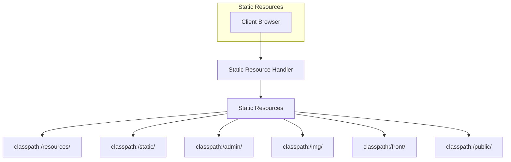

Sources: [src/main/java/com/config/InterceptorConfig.java L25-L38](https://github.com/hjsdjko/huochpiaodingpiao/blob/2f69da4e/src/main/java/com/config/InterceptorConfig.java#L25-L38)

## Frontend Architecture

该应用程序的前端使用Vue.js构建，通过RESTful API调用与后端进行通信。前端组件包括：

1. 不同屏幕的用户界面组件
2. Form validation logic
3. 用于后端通信的API服务模块
4. State management

前端架构采用组件化方法，使其具备模块化和可维护性。

Sources: [README.md

36](https://github.com/hjsdjko/huochpiaodingpiao/blob/2f69da4e/README.md#L36-L36)

## Summary

火车票预订系统采用了一种结构清晰、分层的架构，该架构通过分离关注点来提升可维护性。关键架构特性包括：

1. 表示层、业务逻辑层和数据访问层之间的清晰分离
2. 采用Spring Boot进行基于MVC模式的后端开发
3. MyBatis-Plus 用于简化数据库操作
4. 基于令牌的认证和授权
5. Vue.js前端，用于响应式用户界面

This architecture allows for:

* 可扩展性以应对日益增长的用户负载
* 通过明确的职责分离实现可维护性
* 可扩展性以添加新功能
通过适当的身份验证和授权机制实现安全性

# Configuration-System.md
# Configuration System

> **Relevant source files**
> * [src/main/java/com/config/MyMetaObjectHandler.java](https://github.com/hjsdjko/huochpiaodingpiao/blob/2f69da4e/src/main/java/com/config/MyMetaObjectHandler.java)
> * [src/main/java/com/controller/ConfigController.java](https://github.com/hjsdjko/huochpiaodingpiao/blob/2f69da4e/src/main/java/com/controller/ConfigController.java)
> * [src/main/java/com/dao/ConfigDao.java](https://github.com/hjsdjko/huochpiaodingpiao/blob/2f69da4e/src/main/java/com/dao/ConfigDao.java)
> * [src/main/java/com/entity/ConfigEntity.java](https://github.com/hjsdjko/huochpiaodingpiao/blob/2f69da4e/src/main/java/com/entity/ConfigEntity.java)

## Purpose and Scope

配置系统为火车票预订系统中的应用程序设置管理提供了一个集中式的键值存储。它支持通过REST API存储和检索配置值，这些值可以被应用程序的各个组件访问。

## Data Model

配置系统是围绕一个简单的实体模型构建的，该模型映射到数据库：

```

```

Where:

* `id`: 自增主键
* `name`: 配置键标识符（例如："faceFile"）
* `value`: 存储的配置值

Sources: [src/main/java/com/entity/ConfigEntity.java L15-L55](https://github.com/hjsdjko/huochpiaodingpiao/blob/2f69da4e/src/main/java/com/entity/ConfigEntity.java#L15-L55)

## System Architecture

配置系统遵循贯穿整个应用程序的典型三层架构模式：

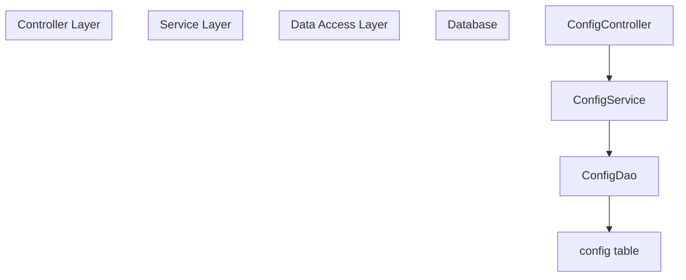

Sources: [src/main/java/com/controller/ConfigController.java](https://github.com/hjsdjko/huochpiaodingpiao/blob/2f69da4e/src/main/java/com/controller/ConfigController.java)

 [src/main/java/com/dao/ConfigDao.java](https://github.com/hjsdjko/huochpiaodingpiao/blob/2f69da4e/src/main/java/com/dao/ConfigDao.java)

 [src/main/java/com/entity/ConfigEntity.java](https://github.com/hjsdjko/huochpiaodingpiao/blob/2f69da4e/src/main/java/com/entity/ConfigEntity.java)

## API Endpoints

系统暴露以下用于配置管理的REST端点：

| Endpoint | Method | Auth Required | Description |
| --- | --- | --- | --- |
| `/config/page` | GET | Yes | Paginated list of configurations |
| `/config/list` | GET | No | List all configurations (public) |
| `/config/info/{id}` | GET | Yes | Get configuration by ID |
| `/config/detail/{id}` | GET | No | Get configuration by ID (public) |
| `/config/info?name=X` | GET | Yes | Get configuration by name |
| `/config/save` | POST | Yes | Create new configuration |
| `/config/update` | POST | Yes | Update existing configuration |
| `/config/delete` | POST | Yes | Delete configurations by IDs |

Sources: [src/main/java/com/controller/ConfigController.java L37-L110](https://github.com/hjsdjko/huochpiaodingpiao/blob/2f69da4e/src/main/java/com/controller/ConfigController.java#L37-L110)

## Request Flow

以下序列图展示了典型的配置检索过程：

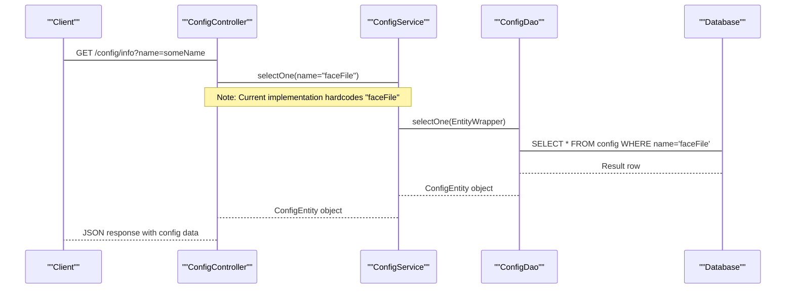

Sources: [src/main/java/com/controller/ConfigController.java L77-L81](https://github.com/hjsdjko/huochpiaodingpiao/blob/2f69da4e/src/main/java/com/controller/ConfigController.java#L77-L81)

## Implementation Details

### Entity Definition

`ConfigEntity`类通过MyBatis-Plus注解映射到数据库：

```
@TableName("config")
public class ConfigEntity implements Serializable {
    @TableId(type = IdType.AUTO)
    private Long id;
    private String name;
    private String value;
    // Getters and setters...
}
```

Sources: [src/main/java/com/entity/ConfigEntity.java L14-L54](https://github.com/hjsdjko/huochpiaodingpiao/blob/2f69da4e/src/main/java/com/entity/ConfigEntity.java#L14-L54)

### Data Access Layer

`ConfigDao` 接口继承 MyBatis-Plus 的 `BaseMapper` 以自动提供增删改查操作：

```
public interface ConfigDao extends BaseMapper<ConfigEntity> {
}
```

这个简单的接口声明提供了诸如以下功能：

* `insert(ConfigEntity entity)`
* `updateById(ConfigEntity entity)`
* `selectById(Long id)`
* `selectOne(EntityWrapper<ConfigEntity> wrapper)`
* `deleteBatchIds(List<Long> ids)`

Sources: [src/main/java/com/dao/ConfigDao.java L10-L12](https://github.com/hjsdjko/huochpiaodingpiao/blob/2f69da4e/src/main/java/com/dao/ConfigDao.java#L10-L12)

### Controller Implementation

控制器处理各种配置操作：

1. **Paginated listing**:

```
@RequestMapping("/page")
public R page(@RequestParam Map<String, Object> params, ConfigEntity config) {
    PageUtils page = configService.queryPage(params);
    return R.ok().put("data", page);
}
```
2. **Retrieving by ID**:

```
@RequestMapping("/info/{id}")
public R info(@PathVariable("id") String id) {
    ConfigEntity config = configService.selectById(id);
    return R.ok().put("data", config);
}
```
3. **通过名称检索**（注意：当前硬编码以检索 'faceFile'）

```
@RequestMapping("/info")
public R infoByName(@RequestParam String name) {
    ConfigEntity config = configService.selectOne(
        new EntityWrapper<ConfigEntity>().eq("name", "faceFile")
    );
    return R.ok().put("data", config);
}
```

Sources: [src/main/java/com/controller/ConfigController.java L37-L110](https://github.com/hjsdjko/huochpiaodingpiao/blob/2f69da4e/src/main/java/com/controller/ConfigController.java#L37-L110)

## Access Control

配置系统通过使用 `@IgnoreAuth` 注解实现选择性认证：

```

```

Sources: [src/main/java/com/controller/ConfigController.java

47](https://github.com/hjsdjko/huochpiaodingpiao/blob/2f69da4e/src/main/java/com/controller/ConfigController.java#L47-L47)

 [src/main/java/com/controller/ConfigController.java

67](https://github.com/hjsdjko/huochpiaodingpiao/blob/2f69da4e/src/main/java/com/controller/ConfigController.java#L67-L67)

## Configuration Usage

当前的实现表明，“faceFile”配置对应用程序非常重要，因为它在`infoByName`方法中被明确硬编码。该配置很可能存储与文件上传或人脸识别功能相关的路径或设置。

```
@RequestMapping("/info")
public R infoByName(@RequestParam String name) {
    ConfigEntity config = configService.selectOne(
        new EntityWrapper<ConfigEntity>().eq("name", "faceFile")
    );
    return R.ok().put("data", config);
}
```

Sources: [src/main/java/com/controller/ConfigController.java L77-L81](https://github.com/hjsdjko/huochpiaodingpiao/blob/2f69da4e/src/main/java/com/controller/ConfigController.java#L77-L81)

## Integration with MyBatis-Plus

配置系统采用MyBatis-Plus实现ORM功能，其提供以下功能：

1. **通过`BaseMapper`接口实现的自动CRUD操作**
2. **使用 EntityWrapper 进行条件查询构建**
3. **分页支持** 通过 `PageUtils` 类

如需了解此配置系统所融入的更广泛系统架构的更多信息，请参见 [系统架构](/hjsdjko/huochpiaodingpiao/2-system-architecture)。

Sources: [src/main/java/com/dao/ConfigDao.java](https://github.com/hjsdjko/huochpiaodingpiao/blob/2f69da4e/src/main/java/com/dao/ConfigDao.java)

 [src/main/java/com/controller/ConfigController.java L39-L41](https://github.com/hjsdjko/huochpiaodingpiao/blob/2f69da4e/src/main/java/com/controller/ConfigController.java#L39-L41)

# Dictionary-System.md
# Dictionary System

> **Relevant source files**
> * [src/main/java/com/ServletContextListener/DictionaryServletContextListener.java](https://github.com/hjsdjko/huochpiaodingpiao/blob/2f69da4e/src/main/java/com/ServletContextListener/DictionaryServletContextListener.java)
> * [src/main/java/com/controller/DictionaryController.java](https://github.com/hjsdjko/huochpiaodingpiao/blob/2f69da4e/src/main/java/com/controller/DictionaryController.java)
> * [src/main/java/com/dao/DictionaryDao.java](https://github.com/hjsdjko/huochpiaodingpiao/blob/2f69da4e/src/main/java/com/dao/DictionaryDao.java)

## Purpose and Scope

字典系统为火车票预订应用程序中的查找值、下拉选项以及代码到显示名称的转换提供了灵活且集中的管理机制。而不是将这些值硬编码，它们被存储在数据库表中，并在应用程序启动时加载到内存中，从而允许运行时配置和更简单的维护。

本文档涵盖字典系统的架构、数据库结构、初始化过程和使用模式。有关更广泛的配置系统的信息，请参见 [配置系统](/hjsdjko/huochpiaodingpiao/2.1-configuration-system)。

Sources: [src/main/java/com/ServletContextListener/DictionaryServletContextListener.java L19-L22](https://github.com/hjsdjko/huochpiaodingpiao/blob/2f69da4e/src/main/java/com/ServletContextListener/DictionaryServletContextListener.java#L19-L22)

 [src/main/java/com/controller/DictionaryController.java L35-L40](https://github.com/hjsdjko/huochpiaodingpiao/blob/2f69da4e/src/main/java/com/controller/DictionaryController.java#L35-L40)

## Dictionary Data Structure

词典系统存储按词典类别组织的键值对。每个词典条目包含以下内容：

| Field | Description |
| --- | --- |
| `id` | Primary key |
| `dicCode` | Dictionary category code (e.g., "sex_types", "checi_types") |
| `dicName` | Name of the dictionary category |
| `codeIndex` | Numeric code value within the category |
| `indexName` | Display name for the code value |
| `superId` | Parent dictionary ID (for hierarchical dictionaries) |
| `beizhu` | Comments or notes |
| `createTime` | Creation timestamp |

Sources: [src/main/java/com/dao/DictionaryDao.java L13-L16](https://github.com/hjsdjko/huochpiaodingpiao/blob/2f69da4e/src/main/java/com/dao/DictionaryDao.java#L13-L16)

 [src/main/java/com/controller/DictionaryController.java L113-L119](https://github.com/hjsdjko/huochpiaodingpiao/blob/2f69da4e/src/main/java/com/controller/DictionaryController.java#L113-L119)

 [src/main/java/com/ServletContextListener/DictionaryServletContextListener.java L40-L46](https://github.com/hjsdjko/huochpiaodingpiao/blob/2f69da4e/src/main/java/com/ServletContextListener/DictionaryServletContextListener.java#L40-L46)

## System Architecture

以下是字典系统的架构及其与应用程序其余部分的集成方式：

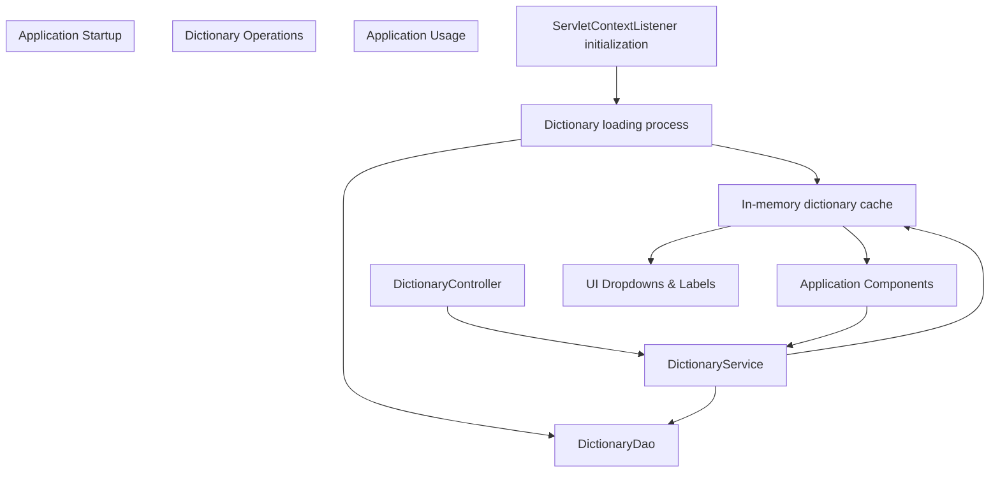

Sources: [src/main/java/com/ServletContextListener/DictionaryServletContextListener.java L32-L49](https://github.com/hjsdjko/huochpiaodingpiao/blob/2f69da4e/src/main/java/com/ServletContextListener/DictionaryServletContextListener.java#L32-L49)

 [src/main/java/com/controller/DictionaryController.java L41-L44](https://github.com/hjsdjko/huochpiaodingpiao/blob/2f69da4e/src/main/java/com/controller/DictionaryController.java#L41-L44)

## Dictionary Initialization Process

字典系统在应用程序启动时通过`DictionaryServletContextListener`进行初始化：

1. 带有 `@WebListener` 注解的监听器在应用程序启动时自动执行
2. 它从数据库中检索所有字典条目
3. 它构建了一个嵌套映射结构以实现高效查找。
4. 它将此地图存储在servlet上下文中，命名为"dictionaryMap"

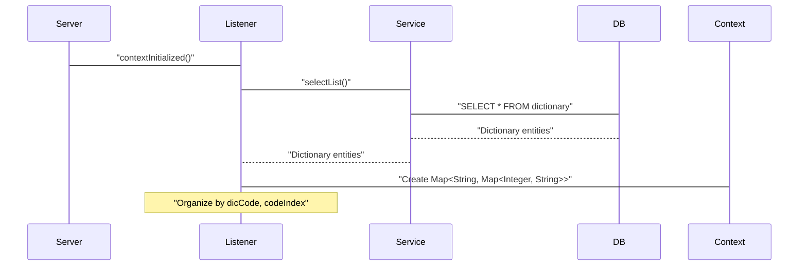

内存中的字典结构是：

```
Map<String, Map<Integer, String>>
```

Where:

* 外部键：`dicCode`（字典类别）
* 内部键：`codeIndex`（数字代码）
* 值：`indexName`（显示名称）

For example:

```
{
  "sex_types": {
    1: "Male",
    2: "Female"
  },
  "checi_types": {
    1: "High-speed Railway",
    2: "Regular Train",
    3: "Express Train"
  }
}
```

Sources: [src/main/java/com/ServletContextListener/DictionaryServletContextListener.java L32-L49](https://github.com/hjsdjko/huochpiaodingpiao/blob/2f69da4e/src/main/java/com/ServletContextListener/DictionaryServletContextListener.java#L32-L49)

 [src/main/java/com/ServletContextListener/DictionaryServletContextListener.java L37-L48](https://github.com/hjsdjko/huochpiaodingpiao/blob/2f69da4e/src/main/java/com/ServletContextListener/DictionaryServletContextListener.java#L37-L48)

## Dictionary Management API

字典系统提供一个用于管理字典条目的REST API：

| Endpoint | Method | Description |
| --- | --- | --- |
| `/dictionary/page` | GET | List dictionaries with pagination |
| `/dictionary/info/{id}` | GET | Get details for a specific dictionary entry |
| `/dictionary/save` | POST | Create a new dictionary entry |
| `/dictionary/update` | POST | Update an existing dictionary entry |
| `/dictionary/delete` | POST | Delete dictionary entries |
| `/dictionary/maxCodeIndex` | POST | Get next available code index for a dictionary category |
| `/dictionary/batchInsert` | POST | Batch import dictionaries from Excel |

当字典条目被创建、更新或删除时，控制器：

1. 执行数据库操作
2. 重新加载所有词典数据
3. 重建内存中的字典映射
4. 在Servlet上下文中更新字典映射

这确保了内存缓存与数据库保持同步。

Sources: [src/main/java/com/controller/DictionaryController.java L63-L271](https://github.com/hjsdjko/huochpiaodingpiao/blob/2f69da4e/src/main/java/com/controller/DictionaryController.java#L63-L271)

 [src/main/java/com/controller/DictionaryController.java L126-L138](https://github.com/hjsdjko/huochpiaodingpiao/blob/2f69da4e/src/main/java/com/controller/DictionaryController.java#L126-L138)

 [src/main/java/com/controller/DictionaryController.java L168-L182](https://github.com/hjsdjko/huochpiaodingpiao/blob/2f69da4e/src/main/java/com/controller/DictionaryController.java#L168-L182)

## 应用中的使用

词典系统在整个应用程序中被用于：

1. 在用户界面中填充下拉菜单
2. 将内部代码值转换为人类可读的显示名称
3. 支持多级层次结构的参考数据（例如：省/城市）

当视图返回给客户端时，字典系统会自动将代码值转换为它们的显示等效值：

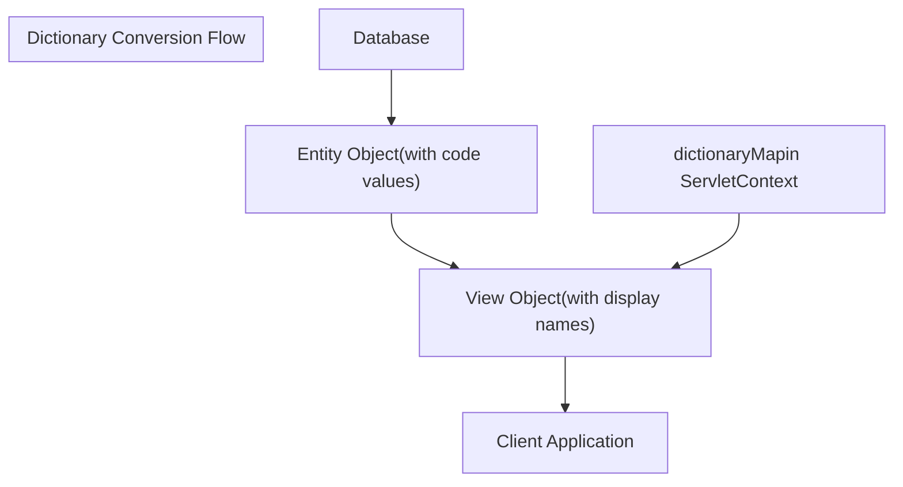

对于层级字典（通过包含“_erji_types”的代码标识），系统使用`superId`字段来维护父子关系。这支持UI中的依赖下拉框功能，其中选择父选项会过滤可用的子选项。

Sources: [src/main/java/com/controller/DictionaryController.java L72-L77](https://github.com/hjsdjko/huochpiaodingpiao/blob/2f69da4e/src/main/java/com/controller/DictionaryController.java#L72-L77)

 [src/main/java/com/controller/DictionaryController.java L93-L94](https://github.com/hjsdjko/huochpiaodingpiao/blob/2f69da4e/src/main/java/com/controller/DictionaryController.java#L93-L94)

 [src/main/java/com/controller/DictionaryController.java L113-L119](https://github.com/hjsdjko/huochpiaodingpiao/blob/2f69da4e/src/main/java/com/controller/DictionaryController.java#L113-L119)

 [src/main/java/com/controller/DictionaryController.java L162-L164](https://github.com/hjsdjko/huochpiaodingpiao/blob/2f69da4e/src/main/java/com/controller/DictionaryController.java#L162-L164)

## 层次化字典的特殊处理

系统对层次化字典（由`dicCode`包含"_erji_types"标识的字典）提供特殊处理：

1. 保存或更新条目时，会检查同一父级下的唯一性
2. 在查询时，可以根据其父ID过滤条目

这允许相同的`codeIndex`和`indexName`存在于不同的父条目下，支持地理层级结构（省/市）或产品类别及子类别等复杂的数据结构。

Sources: [src/main/java/com/controller/DictionaryController.java L117-L119](https://github.com/hjsdjko/huochpiaodingpiao/blob/2f69da4e/src/main/java/com/controller/DictionaryController.java#L117-L119)

 [src/main/java/com/controller/DictionaryController.java L162-L164](https://github.com/hjsdjko/huochpiaodingpiao/blob/2f69da4e/src/main/java/com/controller/DictionaryController.java#L162-L164)

## Dictionary System Security

词典API包含适当的安全控制：

* 一些端点（例如 `/page`）通过标注 `@IgnoreAuth` 来允许公开访问
* 其他端点在允许操作之前检查用户的角色
* 后端操作通过验证输入来防止重复条目

Sources: [src/main/java/com/controller/DictionaryController.java

64](https://github.com/hjsdjko/huochpiaodingpiao/blob/2f69da4e/src/main/java/com/controller/DictionaryController.java#L64-L64)

 [src/main/java/com/controller/DictionaryController.java L109-L110](https://github.com/hjsdjko/huochpiaodingpiao/blob/2f69da4e/src/main/java/com/controller/DictionaryController.java#L109-L110)

 [src/main/java/com/controller/DictionaryController.java L152-L154](https://github.com/hjsdjko/huochpiaodingpiao/blob/2f69da4e/src/main/java/com/controller/DictionaryController.java#L152-L154)

## Conclusion

字典系统提供了一种灵活、数据库驱动的方法，用于在整个应用程序中管理参考数据。其内存缓存策略在优化性能的同时允许运行时更新。分层支持使系统能够处理复杂的数据关系，使其适用于火车票预订应用中的各种参考数据需求。

# Core-Entities.md
# Core Entities

> **Relevant source files**
> * [src/main/java/com/dao/YonghuDao.java](https://github.com/hjsdjko/huochpiaodingpiao/blob/2f69da4e/src/main/java/com/dao/YonghuDao.java)
> * [src/main/java/com/entity/CheciEntity.java](https://github.com/hjsdjko/huochpiaodingpiao/blob/2f69da4e/src/main/java/com/entity/CheciEntity.java)
> * [src/main/java/com/entity/CheciOrderEntity.java](https://github.com/hjsdjko/huochpiaodingpiao/blob/2f69da4e/src/main/java/com/entity/CheciOrderEntity.java)

本页面记录了火车票预订系统中的主要数据实体及其相互关系。这些实体构成了系统数据模型的基础，对于理解数据在应用程序中的流动至关重要。

关于这些实体如何配置的信息，请参见[配置系统](/hjsdjko/huochpiaodingpiao/2.1-configuration-system)。有关字典系统如何影响这些实体的详细信息，请参见[字典系统](/hjsdjko/huochpiaodingpiao/2.2-dictionary-system)。

## 核心实体概述

列车票务预订系统围绕三个主要实体展开，这些实体构成了应用的核心：

1. **列车时刻表实体（Checi）** - 包含列车时刻表和可用座位的信息
2. **用户实体 (Yonghu)** - 表示可以预订票的注册用户
3. **票务订单实体 (CheciOrder)** - 记录票务购买及相关详情

这些实体通过协作实现系统的功能：允许用户查询列车时刻表并购买车票。

```

```

Sources: [src/main/java/com/entity/CheciEntity.java L30-L367](https://github.com/hjsdjko/huochpiaodingpiao/blob/2f69da4e/src/main/java/com/entity/CheciEntity.java#L30-L367)

 [src/main/java/com/entity/CheciOrderEntity.java L30-L303](https://github.com/hjsdjko/huochpiaodingpiao/blob/2f69da4e/src/main/java/com/entity/CheciOrderEntity.java#L30-L303)

 [src/main/java/com/dao/YonghuDao.java L12-L21](https://github.com/hjsdjko/huochpiaodingpiao/blob/2f69da4e/src/main/java/com/dao/YonghuDao.java#L12-L21)

## Entity Details

### Train Schedule (Checi)

`CheciEntity`类代表系统中的火车时刻表。它映射到数据库中的"checi"表。

#### Key Attributes

| Attribute | Type | Description |
| --- | --- | --- |
| id | Integer | Primary key |
| checiName | String | Train number/identifier |
| checiPhoto | String | Path to train image |
| checiTypes | Integer | Type of train (references Dictionary system) |
| checiNewMoney | Double | Current ticket price |
| checiChufadi | String | Departure location |
| checiMudidi | String | Destination location |
| checiTime | Date | Departure time |
| sectionNumber | Integer | Number of train carriages/sections |
| zuoweiNumber | Integer | Number of seats |
| shangxiaTypes | Integer | Publication status (published/unpublished) |
| checiDelete | Integer | Logical deletion flag (soft delete) |
| checiContent | String | Details of stops and arrival times |
| createTime | Date | Record creation timestamp |

Sources: [src/main/java/com/entity/CheciEntity.java L47-L162](https://github.com/hjsdjko/huochpiaodingpiao/blob/2f69da4e/src/main/java/com/entity/CheciEntity.java#L47-L162)

### User (Yonghu)

`YonghuEntity` 类代表可以订票的注册用户。名称 "Yonghu" 在英文中翻译为 "user" 或 "member"。

#### Key Attributes

| Attribute | Type | Description |
| --- | --- | --- |
| id | Integer | Primary key |
| username | String | User's login name |
| password | String | User's password (hashed) |
| newMoney | Double | User's account balance |
| yonghuPhone | String | User's phone number |
| yonghuIdNumber | String | User's ID document number |
| yonghuDelete | Integer | Logical deletion flag (soft delete) |
| createTime | Date | Account creation timestamp |

Sources: [src/main/java/com/dao/YonghuDao.java L12-L21](https://github.com/hjsdjko/huochpiaodingpiao/blob/2f69da4e/src/main/java/com/dao/YonghuDao.java#L12-L21)

### Ticket Order (CheciOrder)

`CheciOrderEntity`类代表购票交易。它映射到数据库中的"checi_order"表。

#### Key Attributes

| Attribute | Type | Description |
| --- | --- | --- |
| id | Integer | Primary key |
| checiOrderUuidNumber | String | Unique order identifier |
| checiId | Integer | Foreign key to Checi entity |
| yonghuId | Integer | Foreign key to Yonghu entity |
| checiOrderTruePrice | Double | Actual payment amount |
| checiOrderTypes | Integer | Order status (references Dictionary system) |
| buySectionNumber | Integer | Reserved carriage/section number |
| buyZuoweiNumber | String | Reserved seat number |
| buyZuoweiTime | Date | Booking date |
| insertTime | Date | Order creation timestamp |
| createTime | Date | Record creation timestamp |

Sources: [src/main/java/com/entity/CheciOrderEntity.java L47-L140](https://github.com/hjsdjko/huochpiaodingpiao/blob/2f69da4e/src/main/java/com/entity/CheciOrderEntity.java#L47-L140)

## Entity Relationships

下图说明了系统中核心实体之间的关系：

```
#mermaid-pypxawyptj{font-family:ui-sans-serif,-apple-system,system-ui,Segoe UI,Helvetica;font-size:16px;fill:#333;}@keyframes edge-animation-frame{from{stroke-dashoffset:0;}}@keyframes dash{to{stroke-dashoffset:0;}}#mermaid-pypxawyptj .edge-animation-slow{stroke-dasharray:9,5!important;stroke-dashoffset:900;animation:dash 50s linear infinite;stroke-linecap:round;}#mermaid-pypxawyptj .edge-animation-fast{stroke-dasharray:9,5!important;stroke-dashoffset:900;animation:dash 20s linear infinite;stroke-linecap:round;}#mermaid-pypxawyptj .error-icon{fill:#dddddd;}#mermaid-pypxawyptj .error-text{fill:#222222;stroke:#222222;}#mermaid-pypxawyptj .edge-thickness-normal{stroke-width:1px;}#mermaid-pypxawyptj .edge-thickness-thick{stroke-width:3.5px;}#mermaid-pypxawyptj .edge-pattern-solid{stroke-dasharray:0;}#mermaid-pypxawyptj .edge-thickness-invisible{stroke-width:0;fill:none;}#mermaid-pypxawyptj .edge-pattern-dashed{stroke-dasharray:3;}#mermaid-pypxawyptj .edge-pattern-dotted{stroke-dasharray:2;}#mermaid-pypxawyptj .marker{fill:#999;stroke:#999;}#mermaid-pypxawyptj .marker.cross{stroke:#999;}#mermaid-pypxawyptj svg{font-family:ui-sans-serif,-apple-system,system-ui,Segoe UI,Helvetica;font-size:16px;}#mermaid-pypxawyptj p{margin:0;}#mermaid-pypxawyptj .entityBox{fill:#ffffff;stroke:#dddddd;}#mermaid-pypxawyptj .relationshipLabelBox{fill:#dddddd;opacity:0.7;background-color:#dddddd;}#mermaid-pypxawyptj .relationshipLabelBox rect{opacity:0.5;}#mermaid-pypxawyptj .labelBkg{background-color:rgba(221, 221, 221, 0.5);}#mermaid-pypxawyptj .edgeLabel .label{fill:#dddddd;font-size:14px;}#mermaid-pypxawyptj .label{font-family:ui-sans-serif,-apple-system,system-ui,Segoe UI,Helvetica;color:#333;}#mermaid-pypxawyptj .edge-pattern-dashed{stroke-dasharray:8,8;}#mermaid-pypxawyptj .node rect,#mermaid-pypxawyptj .node circle,#mermaid-pypxawyptj .node ellipse,#mermaid-pypxawyptj .node polygon{fill:#ffffff;stroke:#dddddd;stroke-width:1px;}#mermaid-pypxawyptj .relationshipLine{stroke:#999;stroke-width:1;fill:none;}#mermaid-pypxawyptj .marker{fill:none!important;stroke:#999!important;stroke-width:1;}#mermaid-pypxawyptj :root{--mermaid-font-family:"trebuchet ms",verdana,arial,sans-serif;}placesfulfillsYONGHUintidPKstringusernamestringpasswordfloatnewMoneystringyonghuPhonestringyonghuIdNumberintyonghuDeletedatecreateTimeCHECI_ORDERintidPKstringcheciOrderUuidNumberintcheciIdFKintyonghuIdFKdoublecheciOrderTruePriceintcheciOrderTypesintbuySectionNumberstringbuyZuoweiNumberdatebuyZuoweiTimedateinsertTimedatecreateTimeCHECIintidPKstringcheciNamestringcheciPhotointcheciTypesdoublecheciNewMoneystringcheciChufadistringcheciMudididatecheciTimeintsectionNumberintzuoweiNumberintshangxiaTypesintcheciDeletestringcheciContentdatecreateTime
```

Sources: [src/main/java/com/entity/CheciEntity.java L30-L367](https://github.com/hjsdjko/huochpiaodingpiao/blob/2f69da4e/src/main/java/com/entity/CheciEntity.java#L30-L367)

 [src/main/java/com/entity/CheciOrderEntity.java L30-L303](https://github.com/hjsdjko/huochpiaodingpiao/blob/2f69da4e/src/main/java/com/entity/CheciOrderEntity.java#L30-L303)

 [src/main/java/com/dao/YonghuDao.java L12-L21](https://github.com/hjsdjko/huochpiaodingpiao/blob/2f69da4e/src/main/java/com/dao/YonghuDao.java#L12-L21)

## Persistence Layer Implementation

每个实体均按照标准模式实现：

1. **实体类** - 与数据库列对应的Java类，使用MyBatis-Plus注解标注
2. **DAO接口** - 继承 MyBatis-Plus 的 `BaseMapper<Entity>` 实现 CRUD 操作
3. **服务接口/实现** - 利用数据访问对象（DAO）的业务逻辑层

系统使用MyBatis-Plus注解进行对象关系映射：

* `@TableName` - 将类映射到数据库表
* `@TableId` - 标识主键字段
* `@TableField` - 将类字段映射到数据库列

代码结构中实体之间的关系示例：

```

```

Sources: [src/main/java/com/entity/CheciEntity.java L30-L367](https://github.com/hjsdjko/huochpiaodingpiao/blob/2f69da4e/src/main/java/com/entity/CheciEntity.java#L30-L367)

 [src/main/java/com/entity/CheciOrderEntity.java L30-L303](https://github.com/hjsdjko/huochpiaodingpiao/blob/2f69da4e/src/main/java/com/entity/CheciOrderEntity.java#L30-L303)

 [src/main/java/com/dao/YonghuDao.java L12-L21](https://github.com/hjsdjko/huochpiaodingpiao/blob/2f69da4e/src/main/java/com/dao/YonghuDao.java#L12-L21)

## Technical Implementation Details

### Entity Class Structure

系统中的每个实体类都遵循类似的模式：

1. 每个都使用`@TableName`注解来指定对应的数据库表
2. 所有实现 `Serializable` 用于对象序列化
3. 每个都包含一个通用构造函数，可以从另一个对象复制属性
4. 日期字段使用 `@JsonFormat` 注解以实现正确的JSON序列化
5. 每个都包含所有属性的获取器和设置器
6. 每个都覆盖 `toString()` 以提供更好的调试支持

实体类模式示例（来自CheciEntity）：

```
@TableName("checi")
public class CheciEntity<T> implements Serializable {
    // Fields with annotations
    @TableId(type = IdType.AUTO)
    @TableField(value = "id")
    private Integer id;
    
    // Constructor with BeanUtils.copyProperties
    public CheciEntity(T t) {
        try {
            BeanUtils.copyProperties(this, t);
        } catch (IllegalAccessException | InvocationTargetException e) {
            e.printStackTrace();
        }
    }
    
    // Getters and setters
    
    // toString override
}
```

Sources: [src/main/java/com/entity/CheciEntity.java L29-L45](https://github.com/hjsdjko/huochpiaodingpiao/blob/2f69da4e/src/main/java/com/entity/CheciEntity.java#L29-L45)

### Soft Delete Pattern

所有核心实体均通过使用整型标志字段实现软删除模式：

* `checiDelete` 删除车次安排
* `yonghuDelete` for users

这使得系统能够在不从数据库中物理删除记录的情况下标记记录为已删除，从而保持数据完整性并实现潜在的数据恢复。

Sources: [src/main/java/com/entity/CheciEntity.java L139-L144](https://github.com/hjsdjko/huochpiaodingpiao/blob/2f69da4e/src/main/java/com/entity/CheciEntity.java#L139-L144)

## Practical Application

这些核心实体协同工作以实现票务预订流程：

1. 用户（Yonghu）注册账户并向余额添加资金
2. 管理员创建火车时刻表（Checi），包含路线、时间以及可用座位数等详细信息。
3. 用户搜索并选择可用的列车
4. 当用户预订车票时，会创建一个新的订单（CheciOrder），将用户与列车关联。
5. 系统从用户的余额中扣除资金，并保留所选座位

如需了解这些实体在票务流程中的具体使用方式，请参见 [票务流程](/hjsdjko/huochpiaodingpiao/7-ticket-booking-process)。

# Authentication-System.md
# Authentication System

> **Relevant source files**
> * [src/main/java/com/annotation/APPLoginUser.java](https://github.com/hjsdjko/huochpiaodingpiao/blob/2f69da4e/src/main/java/com/annotation/APPLoginUser.java)
> * [src/main/java/com/annotation/IgnoreAuth.java](https://github.com/hjsdjko/huochpiaodingpiao/blob/2f69da4e/src/main/java/com/annotation/IgnoreAuth.java)
> * [src/main/java/com/annotation/LoginUser.java](https://github.com/hjsdjko/huochpiaodingpiao/blob/2f69da4e/src/main/java/com/annotation/LoginUser.java)
> * [src/main/java/com/config/InterceptorConfig.java](https://github.com/hjsdjko/huochpiaodingpiao/blob/2f69da4e/src/main/java/com/config/InterceptorConfig.java)
> * [src/main/java/com/controller/UsersController.java](https://github.com/hjsdjko/huochpiaodingpiao/blob/2f69da4e/src/main/java/com/controller/UsersController.java)
> * [src/main/java/com/dao/TokenDao.java](https://github.com/hjsdjko/huochpiaodingpiao/blob/2f69da4e/src/main/java/com/dao/TokenDao.java)

本页面文档说明火车票预订系统中使用的基于令牌的认证和授权机制。它解释了认证流程、核心组件以及保护应用程序的处理过程。

关于用户注册和管理的信息，请参见 [用户管理](/hjsdjko/huochpiaodingpiao/5-user-management)。

## Overview

认证系统基于令牌机制构建，用户通过用户名/密码进行认证，获取令牌后使用该令牌进行后续的授权请求。系统支持多种用户角色，并允许在必要时某些接口绕过认证。

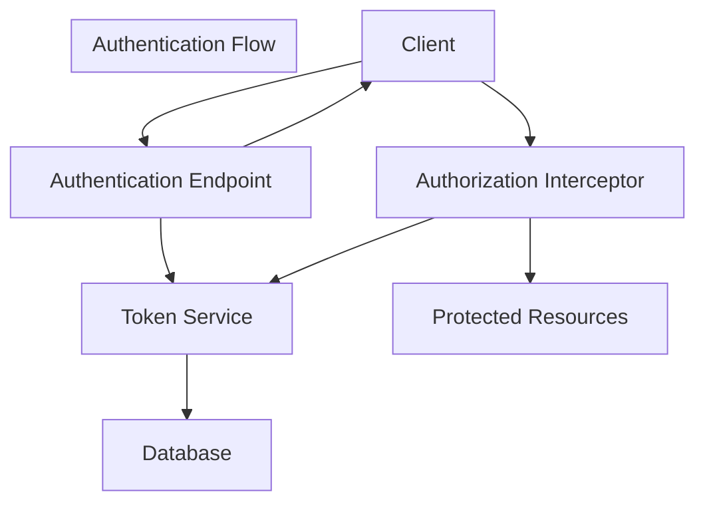

Sources: [src/main/java/com/controller/UsersController.java L41-L57](https://github.com/hjsdjko/huochpiaodingpiao/blob/2f69da4e/src/main/java/com/controller/UsersController.java#L41-L57)

 [src/main/java/com/config/InterceptorConfig.java L12-L23](https://github.com/hjsdjko/huochpiaodingpiao/blob/2f69da4e/src/main/java/com/config/InterceptorConfig.java#L12-L23)

## Core Components

### 1. Annotations

认证系统使用Java注解来控制访问并注入用户信息：

| Annotation | Purpose | Usage |
| --- | --- | --- |
| `@IgnoreAuth` | Marks methods that bypass token validation | Applied to methods that should be publicly accessible |
| `@LoginUser` | Injects authenticated user information | Applied to method parameters to receive the logged-in user |
| `@APPLoginUser` | Variant for mobile app users | Similar to `@LoginUser` but for mobile-specific endpoints |

例如，登录和注册接口被标记为 `@IgnoreAuth`，因为它们需要无需认证即可访问：

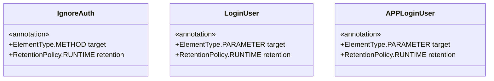

Sources: [src/main/java/com/annotation/IgnoreAuth.java L1-L14](https://github.com/hjsdjko/huochpiaodingpiao/blob/2f69da4e/src/main/java/com/annotation/IgnoreAuth.java#L1-L14)

 [src/main/java/com/annotation/LoginUser.java L1-L16](https://github.com/hjsdjko/huochpiaodingpiao/blob/2f69da4e/src/main/java/com/annotation/LoginUser.java#L1-L16)

 [src/main/java/com/annotation/APPLoginUser.java L1-L16](https://github.com/hjsdjko/huochpiaodingpiao/blob/2f69da4e/src/main/java/com/annotation/APPLoginUser.java#L1-L16)

### 2. Authorization Interceptor

`AuthorizationInterceptor` 配置为拦截所有 HTTP 请求以验证令牌并确保适当的授权。它通过 `InterceptorConfig` 在 Spring MVC 配置中注册。

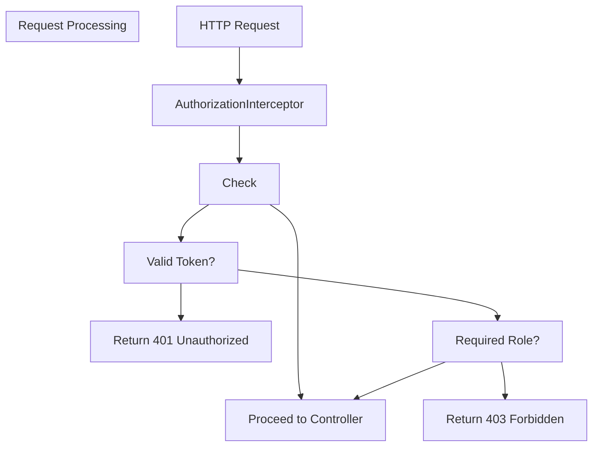

Sources: [src/main/java/com/config/InterceptorConfig.java L1-L39](https://github.com/hjsdjko/huochpiaodingpiao/blob/2f69da4e/src/main/java/com/config/InterceptorConfig.java#L1-L39)

### 3. Token Service

`令牌服务`管理令牌的生成、验证和存储。它使用`令牌DAO`与数据库中的令牌存储进行交互。

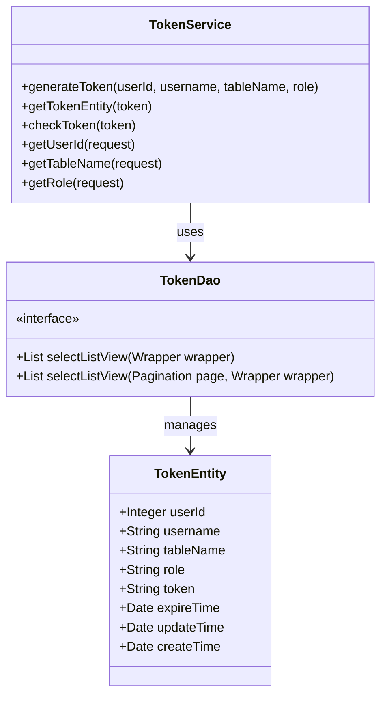

Sources: [src/main/java/com/dao/TokenDao.java L1-L23](https://github.com/hjsdjko/huochpiaodingpiao/blob/2f69da4e/src/main/java/com/dao/TokenDao.java#L1-L23)

## Authentication Process

### Login Flow

1. 用户提交凭证到 `/users/login` 端点
2. 系统验证用户名和密码
3. 在成功验证后，`TokenService` 生成一个令牌。
4. Token与用户信息一起存储在数据库中。
5. 令牌返回给客户端以用于未来的请求

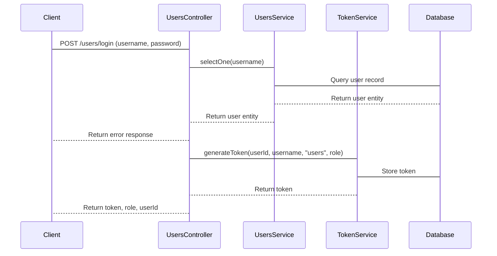

Sources: [src/main/java/com/controller/UsersController.java L41-L57](https://github.com/hjsdjko/huochpiaodingpiao/blob/2f69da4e/src/main/java/com/controller/UsersController.java#L41-L57)

### Token Validation

For each protected request:

1. `AuthorizationInterceptor` 拦截请求
2. 检查该方法是否具有`@IgnoreAuth`注解
3. 若未被忽略，则从请求头中提取令牌
4. 通过 `TokenService` 验证令牌
5. 如果验证通过，用用户信息填充请求。
6. 如果无效，返回401 未授权响应

### User Sessions

系统通过令牌维护用户会话，允许：

1. 通过/users/session端点获取当前用户信息
2. 通过使用`/users/logout`端点进行登出，该操作会使会话失效

Sources: [src/main/java/com/controller/UsersController.java L73-L134](https://github.com/hjsdjko/huochpiaodingpiao/blob/2f69da4e/src/main/java/com/controller/UsersController.java#L73-L134)

## API Reference

### Authentication Endpoints

| Endpoint | Method | Description | Authentication Required |
| --- | --- | --- | --- |
| `/users/login` | POST | Authenticates user and returns a token | No |
| `/users/register` | POST | Registers a new user | No |
| `/users/logout` | GET | Invalidates user session | Yes |
| `/users/resetPass` | POST | Resets user password to default "123456" | No |
| `/users/session` | GET | Retrieves current user information | Yes |

Sources: [src/main/java/com/controller/UsersController.java L31-L168](https://github.com/hjsdjko/huochpiaodingpiao/blob/2f69da4e/src/main/java/com/controller/UsersController.java#L31-L168)

## Security Considerations

1. **Token Management**:

* 令牌具有过期时间，以限制漏洞窗口
* 系统将令牌存储在数据库中，用于验证和撤销功能
2. **Password Security**:

用户密码以明文形式存储，这存在安全漏洞。
* 密码重置功能设置默认密码 ("123456")，用户应立即更改
3. **Public Endpoints**:

* 受限端点通过标记为`@IgnoreAuth`来允许公共访问
* 这些包括登录、注册和密码重置端点。

Sources: [src/main/java/com/controller/UsersController.java L86-L95](https://github.com/hjsdjko/huochpiaodingpiao/blob/2f69da4e/src/main/java/com/controller/UsersController.java#L86-L95)

 [src/main/java/com/annotation/IgnoreAuth.java L1-L14](https://github.com/hjsdjko/huochpiaodingpiao/blob/2f69da4e/src/main/java/com/annotation/IgnoreAuth.java#L1-L14)

## 与其他模块的集成

认证系统与应用程序的多个部分集成：

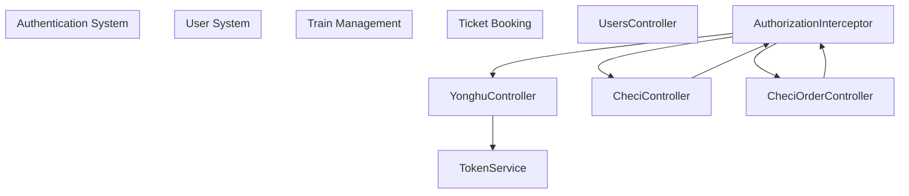

Sources: [src/main/java/com/config/InterceptorConfig.java L19-L23](https://github.com/hjsdjko/huochpiaodingpiao/blob/2f69da4e/src/main/java/com/config/InterceptorConfig.java#L19-L23)

认证系统为火车票预订应用的所有模块提供安全访问的基础，确保资源免受未经授权的访问，同时允许合法用户与系统进行交互。

# User-Management.md
# User Management

> **Relevant source files**
> * [src/main/java/com/controller/UsersController.java](https://github.com/hjsdjko/huochpiaodingpiao/blob/2f69da4e/src/main/java/com/controller/UsersController.java)
> * [src/main/java/com/controller/YonghuController.java](https://github.com/hjsdjko/huochpiaodingpiao/blob/2f69da4e/src/main/java/com/controller/YonghuController.java)
> * [src/main/java/com/dao/YonghuDao.java](https://github.com/hjsdjko/huochpiaodingpiao/blob/2f69da4e/src/main/java/com/dao/YonghuDao.java)

本文档描述了火车票预订应用中的用户管理系统。它涵盖系统中的两种用户类型、认证机制、注册流程、用户操作以及用户管理与其他部分的集成方式。

关于整体系统架构的信息，请参见 [系统架构](/hjsdjko/huochpiaodingpiao/2-system-architecture)。

## 1. User Types

该应用程序支持两种不同的用户类型，分别由各自的控制器和实体进行管理：

1. **管理员用户** (`UsersEntity`): 系统管理员，负责管理应用程序
2. **成员** (`YonghuEntity`): 经常预订火车票的客户

### User Entity Diagram

```

```

Sources: [src/main/java/com/controller/UsersController.java L22-L23](https://github.com/hjsdjko/huochpiaodingpiao/blob/2f69da4e/src/main/java/com/controller/UsersController.java#L22-L23)

 [src/main/java/com/controller/YonghuController.java L28-L33](https://github.com/hjsdjko/huochpiaodingpiao/blob/2f69da4e/src/main/java/com/controller/YonghuController.java#L28-L33)

## 2. Authentication System

该系统对两种用户类型均采用基于令牌的认证机制。认证由`TokenService`管理，并通过拦截器强制执行，这些拦截器在允许访问受保护资源之前会检查有效令牌。

### Authentication Flow

```mermaid
sequenceDiagram
  participant _Client_ as ""Client""
  participant _Controller_ as ""Controller""
  participant _TokenService_ as ""TokenService""
  participant _UserService_ as ""UserService""
  participant _Database_ as ""Database""
  participant client
  participant ctrl
  participant us
  participant db
  participant ts

  client->ctrl: Login request with credentials
  ctrl->us: Validate credentials
  us->db: Query user
  db-->us: User data
  us-->ctrl: Authentication failure
  ctrl-->client: Return error
  us-->ctrl: User authenticated
  ctrl->ts: generateToken(userId, username, tableName, role)
  ts->db: Store token
  ts-->ctrl: Return generated token
  ctrl-->client: Return token and user info
```

Sources: [src/main/java/com/controller/UsersController.java L41-L57](https://github.com/hjsdjko/huochpiaodingpiao/blob/2f69da4e/src/main/java/com/controller/UsersController.java#L41-L57)

 [src/main/java/com/controller/YonghuController.java L310-L334](https://github.com/hjsdjko/huochpiaodingpiao/blob/2f69da4e/src/main/java/com/controller/YonghuController.java#L310-L334)

## 3. User Registration

系统为两种用户类型提供注册接口端点，并通过验证确保用户名、电话号码和身份证号的唯一性。

### Registration Process

```mermaid
flowchart TD

subgraph Validation_Checks ["Validation Checks"]
end

A["Registration Request"]
B["Check for Duplicate Users"]
C["User Already Exists?"]
D["Return Error"]
E["Set Default Values"]
F["Insert New User"]
G["Return Success"]
H["Username Check"]
I["Phone Number Check"]
J["ID Number Check"]

    A --> B
    B --> C
    C --> D
    C --> E
    E --> F
    F --> G
    B --> H
    B --> I
    B --> J
```

对于成员（`YonghuEntity`），注册将设置以下默认值：

* Password: "123456"
* Balance (`newMoney`): 0.0
* 删除标志 (`yonghuDelete`): 1（启用）
* 创建时间戳：当前日期/时间

Sources: [src/main/java/com/controller/YonghuController.java L338-L360](https://github.com/hjsdjko/huochpiaodingpiao/blob/2f69da4e/src/main/java/com/controller/YonghuController.java#L338-L360)

 [src/main/java/com/controller/UsersController.java L59-L71](https://github.com/hjsdjko/huochpiaodingpiao/blob/2f69da4e/src/main/java/com/controller/UsersController.java#L59-L71)

## 4. 用户管理操作

4.1 管理员用户管理

管理员可以对用户账户执行以下操作：

| Operation | Endpoint | Description |
| --- | --- | --- |
| List Users | `/users/page` | Paginated list of users with filtering |
| Get User | `/users/info/{id}` | Get user by ID |
| Add User | `/users/save` | Create new user with validation |
| Update User | `/users/update` | Update user information |
| Delete Users | `/users/delete` | Batch delete users by IDs |
| Reset Password | `/users/resetPass` | Reset password to "123456" |

Sources: [src/main/java/com/controller/UsersController.java L97-L167](https://github.com/hjsdjko/huochpiaodingpiao/blob/2f69da4e/src/main/java/com/controller/UsersController.java#L97-L167)

4.2 会员（客户）管理

系统提供会员账户的全面管理，既包含管理功能，又具备自助服务功能：

| Operation | Endpoint | Description |
| --- | --- | --- |
| List Members | `/yonghu/page` | Paginated list with role-based filtering |
| Get Member | `/yonghu/info/{id}` | Get member by ID |
| Add Member | `/yonghu/save` | Create new member with validation |
| Update Member | `/yonghu/update` | Update member information |
| Delete Members | `/yonghu/delete` | Soft delete (sets `yonghuDelete=2`) |
| Reset Password | `/yonghu/resetPassword` | Admin password reset to "123456" |
| Self-Registration | `/yonghu/register` | Public registration endpoint |
| Forgot Password | `/yonghu/resetPass` | Public password reset endpoint |
| Get Session User | `/yonghu/session` | Get current user from session |

请注意，成员删除通过将 `yonghuDelete` 标志设置为 2 实现软删除，保留数据库中的记录。

Sources: [src/main/java/com/controller/YonghuController.java L62-L198](https://github.com/hjsdjko/huochpiaodingpiao/blob/2f69da4e/src/main/java/com/controller/YonghuController.java#L62-L198)

 [src/main/java/com/controller/YonghuController.java L362-L423](https://github.com/hjsdjko/huochpiaodingpiao/blob/2f69da4e/src/main/java/com/controller/YonghuController.java#L362-L423)

5. 会员余额管理

会员（`YonghuEntity`）拥有用于购票的账户余额（`newMoney`）。余额为：

* 注册时初始化为0.0
* 购票时检查以确保资金充足
* 购票时更新

余额管理是用户管理系统中的关键部分，因为其连接到票务预订功能。

Sources: [src/main/java/com/controller/YonghuController.java

355](https://github.com/hjsdjko/huochpiaodingpiao/blob/2f69da4e/src/main/java/com/controller/YonghuController.java#L355-L355)

## 6. 数据模型集成

### 用户数据访问层

系统使用 MyBatis-Plus 进行数据访问。`YonghuDao` 接口继承 `BaseMapper<YonghuEntity>`，并包含用于分页查询及视图转换的专用方法：

```

```

DAO层支持实体模型和视图模型：

* `YonghuEntity`: Database model
* `YonghuView`: 带有字典转换的显示模型

Sources: [src/main/java/com/dao/YonghuDao.java L1-L22](https://github.com/hjsdjko/huochpiaodingpiao/blob/2f69da4e/src/main/java/com/dao/YonghuDao.java#L1-L22)

## 7. Dictionary Integration

用户相关数据通常使用编码值，需翻译后显示。系统通过以下方式与字典系统集成：

1. 视图模型的字典转换：

```
dictionaryService.dictionaryConvert(view, request);
```

1. 字段的类型转换，例如：
* `sexTypes`: Gender codes
* 角色值和显示名称

这确保了用户属性在整个应用程序中的一致显示。

Sources: [src/main/java/com/controller/YonghuController.java L79-L82](https://github.com/hjsdjko/huochpiaodingpiao/blob/2f69da4e/src/main/java/com/controller/YonghuController.java#L79-L82)

 [src/main/java/com/controller/YonghuController.java L98-L100](https://github.com/hjsdjko/huochpiaodingpiao/blob/2f69da4e/src/main/java/com/controller/YonghuController.java#L98-L100)

## 8. Security Considerations

用户管理系统实施了多项安全实践：

1. **Password Security**:

* 默认密码被设置为 "123456"
* 密码重置功能可用
* 明文密码（应使用哈希进行改进）
2. **Authentication**:

* Token-based authentication
* Session management
* Annotation-based security (`@IgnoreAuth`)
3. **Access Control**:

* Role-based access control
* Session validation
4. **Data Validation**:

* Unique username enforcement
* 唯一电话号码验证
* 唯一ID号码验证

Sources: [src/main/java/com/controller/UsersController.java L44-L57](https://github.com/hjsdjko/huochpiaodingpiao/blob/2f69da4e/src/main/java/com/controller/UsersController.java#L44-L57)

 [src/main/java/com/controller/YonghuController.java L313-L334](https://github.com/hjsdjko/huochpiaodingpiao/blob/2f69da4e/src/main/java/com/controller/YonghuController.java#L313-L334)

## 9. 与票务预订的集成

用户管理与票务预订流程紧密集成：

```mermaid
flowchart TD

subgraph Order_Management_System ["Order Management System"]
end

subgraph Train_Management_System ["Train Management System"]
end

subgraph User_Management_System ["User Management System"]
end

A["User Login"]
B["Authentication"]
C["Browse Train Schedules"]
D["Select Train"]
E["Select Seat"]
F["Check User Balance"]
G["Sufficient Balance?"]
H["Error: Insufficient Balance"]
I["Create Ticket Order"]
J["Deduct User Balance"]
K["Confirm Booking"]

    A --> B
    B --> C
    C --> D
    D --> E
    E --> F
    F --> G
    G --> H
    G --> I
    I --> J
    J --> K
```

此次整合突显了用户管理系统中的账户余额功能对核心票务预订功能的重要性。

Sources: [src/main/java/com/controller/YonghuController.java

355](https://github.com/hjsdjko/huochpiaodingpiao/blob/2f69da4e/src/main/java/com/controller/YonghuController.java#L355-L355)

# Train-Management.md
# Train Management

> **Relevant source files**
> * [src/main/java/com/controller/CheciController.java](https://github.com/hjsdjko/huochpiaodingpiao/blob/2f69da4e/src/main/java/com/controller/CheciController.java)
> * [src/main/java/com/dao/CheciDao.java](https://github.com/hjsdjko/huochpiaodingpiao/blob/2f69da4e/src/main/java/com/dao/CheciDao.java)
> * [src/main/java/com/entity/CheciEntity.java](https://github.com/hjsdjko/huochpiaodingpiao/blob/2f69da4e/src/main/java/com/entity/CheciEntity.java)

## Purpose and Scope

本文档详细说明了火车票预订应用中的列车管理子系统。该系统负责处理列车时刻表、路线、座位配置及相关操作的创建、管理与显示。它是维护乘客可预订核心库存的核心组件。

关于实际的预订流程信息，请参见 [票务预订流程](/hjsdjko/huochpiaodingpiao/7-ticket-booking-process)。

Sources: [src/main/java/com/entity/CheciEntity.java L23-L29](https://github.com/hjsdjko/huochpiaodingpiao/blob/2f69da4e/src/main/java/com/entity/CheciEntity.java#L23-L29)

 [src/main/java/com/controller/CheciController.java L35-L40](https://github.com/hjsdjko/huochpiaodingpiao/blob/2f69da4e/src/main/java/com/controller/CheciController.java#L35-L40)

## Train Entity Model

列车管理系统围绕`CheciEntity`类展开，该类代表列车时刻表。每个列车记录包含关于路线、座位、时间及可用状态的详细信息。

### Core Attributes

| Attribute | Description | Data Type |
| --- | --- | --- |
| id | Primary key identifier | Integer |
| checiName | Train designation/number | String |
| checiPhoto | Image of the train | String (URL) |
| checiTypes | Train type category | Integer |
| checiNewMoney | Current ticket price | Double |
| checiChufadi | Departure location | String |
| checiMudidi | Destination location | String |
| checiTime | Departure time | Date |
| sectionNumber | Number of carriages | Integer |
| zuoweiNumber | Number of seats per carriage | Integer |
| shangxiaTypes | Publication status (1=active) | Integer |
| checiDelete | Deletion flag (1=active, 2=deleted) | Integer |
| checiContent | Detailed information about stops | String |
| createTime | Record creation timestamp | Date |

Sources: [src/main/java/com/entity/CheciEntity.java L30-L367](https://github.com/hjsdjko/huochpiaodingpiao/blob/2f69da4e/src/main/java/com/entity/CheciEntity.java#L30-L367)

### Train Entity Relationships

```mermaid
classDiagram
    class CheciEntity {
        +int id
        +String checiName
        +String checiPhoto
        +int checiTypes
        +double checiNewMoney
        +String checiChufadi
        +String checiMudidi
        +Date checiTime
        +int sectionNumber
        +int zuoweiNumber
        +int shangxiaTypes
        +int checiDelete
        +String checiContent
        +Date createTime
    }
    class CheciOrderEntity {
        +int id
        +String checiOrderUuidNumber
        +int checiId
        +int yonghuId
        +double checiOrderTruePrice
        +int checiOrderTypes
        +int buySectionNumber
        +String buyZuoweiNumber
        +Date buyZuoweiTime
        +Date createTime
    }
    class DictionaryEntity {
        +int id
        +String dicCode
        +String dicName
        +int codeIndex
        +String indexName
    }
    CheciEntity -- CheciOrderEntity : "has orders"
    CheciEntity -- DictionaryEntity : "references for checiTypes"
```

Sources: [src/main/java/com/entity/CheciEntity.java L47-L162](https://github.com/hjsdjko/huochpiaodingpiao/blob/2f69da4e/src/main/java/com/entity/CheciEntity.java#L47-L162)

## Train Management Architecture

列车管理模块遵循由控制器层、服务层和DAO层组成的标准三层架构模式。

```mermaid
flowchart TD

subgraph Data_Access_Layer ["Data Access Layer"]
end

subgraph Service_Layer ["Service Layer"]
end

subgraph Controller_Layer ["Controller Layer"]
end

subgraph Client_Applications ["Client Applications"]
end

Frontend["Vue.js Frontend"]
AdminUI["Admin Interface"]
CheciController["CheciController/checi/*"]
CheciService["CheciService"]
DictionaryService["DictionaryService"]
CheciDao["CheciDao"]
Database["MySQL Database"]

    Frontend --> CheciController
    AdminUI --> CheciController
    CheciController --> CheciService
    CheciController --> DictionaryService
    CheciService --> CheciDao
    CheciDao --> Database
```

Sources: [src/main/java/com/controller/CheciController.java L41-L44](https://github.com/hjsdjko/huochpiaodingpiao/blob/2f69da4e/src/main/java/com/controller/CheciController.java#L41-L44)

 [src/main/java/com/dao/CheciDao.java L12-L17](https://github.com/hjsdjko/huochpiaodingpiao/blob/2f69da4e/src/main/java/com/dao/CheciDao.java#L12-L17)

## REST API Endpoints

列车管理系统为前端客户端应用和后端管理界面提供了独立的REST端点。这些端点由`CheciController`类暴露。

### Administrative Endpoints

| Endpoint | Method | Description |
| --- | --- | --- |
| `/checi/page` | GET | Retrieves a paginated list of trains for admin interfaces |
| `/checi/info/{id}` | GET | Gets detailed information about a specific train by ID |
| `/checi/save` | POST | Creates a new train schedule |
| `/checi/update` | POST | Updates an existing train schedule |
| `/checi/delete` | POST | Performs a soft delete on train records |
| `/checi/batchInsert` | POST | Bulk imports train schedules from Excel files |

### Frontend Endpoints

| Endpoint | Method | Description |
| --- | --- | --- |
| `/checi/list` | GET | Retrieves a paginated list of trains for user interfaces |
| `/checi/detail/{id}` | GET | Gets detailed information about a specific train for user display |
| `/checi/add` | POST | Creates a new train record from the frontend |

Sources: [src/main/java/com/controller/CheciController.java L62-L338](https://github.com/hjsdjko/huochpiaodingpiao/blob/2f69da4e/src/main/java/com/controller/CheciController.java#L62-L338)

## Core Operations

列车列表与分页

系统支持通过/checi/page和/checi/list端点，以各种过滤选项获取分页的列车列表。控制器调用CheciService.queryPage()方法来获取并格式化数据。

列车列表功能的主要特点：

基于角色的过滤（成员只能查看相关的列车）
* 带可自定义页面大小的分页
* 按火车属性筛选
* 分类数据的字典值转换
* 软删除过滤（仅显示活跃的列车）

```mermaid
sequenceDiagram
  participant Client
  participant CheciController
  participant CheciService
  participant DictionaryService
  participant CheciDao
  participant Database

  Client->CheciController: GET /checi/list?params
  CheciController->CheciService: queryPage(params)
  CheciService->CheciDao: selectListView(pagination, params)
  CheciDao->Database: Execute SQL query
  Database-->CheciDao: Raw train records
  CheciDao-->CheciService: Train entity list
  CheciService-->CheciController: PageUtils object
  CheciController->DictionaryService: dictionaryConvert(trainView)
  DictionaryService-->CheciController: Converted view objects
  CheciController-->Client: JSON response with pagination
```

Sources: [src/main/java/com/controller/CheciController.java L65-L85](https://github.com/hjsdjko/huochpiaodingpiao/blob/2f69da4e/src/main/java/com/controller/CheciController.java#L65-L85)

 [src/main/java/com/controller/CheciController.java L269-L285](https://github.com/hjsdjko/huochpiaodingpiao/blob/2f69da4e/src/main/java/com/controller/CheciController.java#L269-L285)

训练集创建与验证

在创建新的列车时刻表时，系统会基于一系列标准进行验证，以确保唯一性：

* Train name
* Train type
* Departure location
* Destination
* Section number
* Seat configuration

验证逻辑通过SQL查询在/checi/save和/checi/add端点中实现，这些查询用于检查是否存在符合这些条件的现有记录。

Sources: [src/main/java/com/controller/CheciController.java L112-L142](https://github.com/hjsdjko/huochpiaodingpiao/blob/2f69da4e/src/main/java/com/controller/CheciController.java#L112-L142)

 [src/main/java/com/controller/CheciController.java L312-L336](https://github.com/hjsdjko/huochpiaodingpiao/blob/2f69da4e/src/main/java/com/controller/CheciController.java#L312-L336)

### Train Update Process

更新火车时刻表涉及与创建类似的验证检查，但通过查询中的`notIn`子句排除当前记录，从而不进行唯一性检查：

```
SELECT * FROM checi 
WHERE id != {trainId} 
  AND checi_name = {name} 
  AND checi_types = {type} 
  AND checi_chufadi = {departure} 
  AND checi_mudidi = {destination} 
  AND section_number = {sections} 
  AND zuowei_number = {seats} 
  AND shangxia_types = {status} 
  AND checi_delete = {deleteFlag}
```

如果此查询未返回结果，则更新操作可以继续进行。

Sources: [src/main/java/com/controller/CheciController.java L147-L179](https://github.com/hjsdjko/huochpiaodingpiao/blob/2f69da4e/src/main/java/com/controller/CheciController.java#L147-L179)

### Soft Deletion

列车管理系统采用逻辑删除方法，而非从数据库中物理删除记录。这是通过`checiDelete`标志实现的：

* `checiDelete = 1`: 活动列车记录
* `checiDelete = 2`: 逻辑删除的列车记录

当通过/checi/delete端点“删除”火车时，其状态会被更改为2，而非删除数据库记录。这样可以保留历史数据，并允许潜在恢复。

```

```

Sources: [src/main/java/com/controller/CheciController.java L184-L198](https://github.com/hjsdjko/huochpiaodingpiao/blob/2f69da4e/src/main/java/com/controller/CheciController.java#L184-L198)

### Train Publication Status

除了删除状态外，列车还具有由`shangxiaTypes`字段控制的发布状态：

`上车下车类型 = 1`: 火车票已发布并可供预订
`上下类型 = 0`: 列车未发布且不可预订

这使管理员能够提前制定列车时刻表，并控制用户对其的可见性，而无需删除它们。

Sources: [src/main/java/com/entity/CheciEntity.java L134-L137](https://github.com/hjsdjko/huochpiaodingpiao/blob/2f69da4e/src/main/java/com/entity/CheciEntity.java#L134-L137)

 [src/main/java/com/controller/CheciController.java

134](https://github.com/hjsdjko/huochpiaodingpiao/blob/2f69da4e/src/main/java/com/controller/CheciController.java#L134-L134)

### Batch Import

系统支持通过/checi/batchInsert端点从Excel文件一次性导入多个列车时刻表。流程如下：

1. 支持 Excel 文件（.xls 格式）
2. 使用 PoiUtil 类来读取文件。
3. 处理每一行（跳过标题行）
4. 从数据中创建训练实体
5. 将它们插入数据库

虽然代码中的实现部分已被部分注释（第229-243行），但该结构展示了批量导入训练数据的能力。

Sources: [src/main/java/com/controller/CheciController.java L204-L260](https://github.com/hjsdjko/huochpiaodingpiao/blob/2f69da4e/src/main/java/com/controller/CheciController.java#L204-L260)

## 与其他系统组件的集成

列车管理系统与多个其他组件集成：

### Dictionary System

列车类型和其他分类值以数值代码形式存储，并通过字典系统转换为显示文本。这是通过调用`dictionaryService.dictionaryConvert()`方法实现的，该方法将原始实体数据转换为包含用户友好显示值的视图对象。

Sources: [src/main/java/com/controller/CheciController.java

83](https://github.com/hjsdjko/huochpiaodingpiao/blob/2f69da4e/src/main/java/com/controller/CheciController.java#L83-L83)

 [src/main/java/com/controller/CheciController.java

101](https://github.com/hjsdjko/huochpiaodingpiao/blob/2f69da4e/src/main/java/com/controller/CheciController.java#L101-L101)

### User Management

列车管理系统与用户管理系统交互以执行访问控制。例如，当列出列车时，系统会根据认证用户的角色应用基于用户的过滤器。

Sources: [src/main/java/com/controller/CheciController.java L68-L72](https://github.com/hjsdjko/huochpiaodingpiao/blob/2f69da4e/src/main/java/com/controller/CheciController.java#L68-L72)

### Ticket Booking Process

通过该系统创建和管理的列车时刻表构成了用户可通过购票流程预订的库存。这些系统之间的完整性通过外键关系和业务逻辑验证得以维持。

最佳实践与注意事项

1. **数据验证**：在插入或更新列车数据之前，始终验证列车数据，以防止重复或无效的列车时刻表。
2. **软删除**：使用软删除功能，而非永久删除记录，以保持数据历史。
3. **发布状态**：利用发布状态来管理列车可见性，而不影响现有数据。
4. **批量操作**：对于大规模更新或导入操作，请使用批量插入功能，而非逐条操作。
5. **词典集成**：确保分类值正确映射到词典系统，以保持显示的一致性。

# Ticket-Booking-Process.md
# Ticket Booking Process

> **Relevant source files**
> * [src/main/java/com/controller/CheciOrderController.java](https://github.com/hjsdjko/huochpiaodingpiao/blob/2f69da4e/src/main/java/com/controller/CheciOrderController.java)
> * [src/main/java/com/dao/CheciOrderDao.java](https://github.com/hjsdjko/huochpiaodingpiao/blob/2f69da4e/src/main/java/com/dao/CheciOrderDao.java)
> * [src/main/java/com/entity/CheciOrderEntity.java](https://github.com/hjsdjko/huochpiaodingpiao/blob/2f69da4e/src/main/java/com/entity/CheciOrderEntity.java)

本文件描述了在火车票预订系统中实现的端到端车票预订流程。它涵盖了从车票选择到支付及订单管理的全过程，包括验证步骤、数据处理和退款操作。

## Overview

车票预订流程主要由`CheciOrderController`处理，该控制器负责创建和管理代表火车票预订的`CheciOrderEntity`对象的生命周期。系统实现了完整的流程，包括搜索可用列车、选择座位、验证用户账户和余额、处理支付以及生成订单确认。

```mermaid
flowchart TD

User["User"]
TrainSearch["Train Search"]
SeatSelection["Seat Selection"]
PaymentValidation["Payment Validation"]
OrderCreation["Order Creation"]
OrderManagement["Order Management"]

    User --> TrainSearch
    TrainSearch --> SeatSelection
    SeatSelection --> PaymentValidation
    PaymentValidation --> OrderCreation
    OrderCreation --> OrderManagement
    OrderManagement --> User
```

Sources: [src/main/java/com/controller/CheciOrderController.java L318-L354](https://github.com/hjsdjko/huochpiaodingpiao/blob/2f69da4e/src/main/java/com/controller/CheciOrderController.java#L318-L354)

 [src/main/java/com/entity/CheciOrderEntity.java L30-L303](https://github.com/hjsdjko/huochpiaodingpiao/blob/2f69da4e/src/main/java/com/entity/CheciOrderEntity.java#L30-L303)

## Core Components

购票流程包括多个关键组件协同工作：

```mermaid
classDiagram
    class CheciOrderController {
        +add()
        +refund()
        +deliver()
        +page()
        +info()
    }
    class CheciOrderEntity {
        +id: Integer
        +checiOrderUuidNumber: String
        +checiId: Integer
        +yonghuId: Integer
        +checiOrderTruePrice: Double
        +checiOrderTypes: Integer
        +buySectionNumber: Integer
        +buyZuoweiNumber: String
        +buyZuoweiTime: Date
    }
    class CheciEntity {
        +checiNewMoney: Double
    }
    class YonghuEntity {
        +newMoney: Double
    }
    CheciOrderController --> CheciOrderEntity : manages
    CheciOrderController --> CheciEntity : validates
    CheciOrderController --> YonghuEntity : checks balance
    CheciOrderEntity --> CheciEntity : references
    CheciOrderEntity --> YonghuEntity : references
```

Sources: [src/main/java/com/controller/CheciOrderController.java L44-L60](https://github.com/hjsdjko/huochpiaodingpiao/blob/2f69da4e/src/main/java/com/controller/CheciOrderController.java#L44-L60)

 [src/main/java/com/entity/CheciOrderEntity.java L30-L303](https://github.com/hjsdjko/huochpiaodingpiao/blob/2f69da4e/src/main/java/com/entity/CheciOrderEntity.java#L30-L303)

## Ticket Booking Workflow

### 1. 查找并选择列车

在预订之前，用户会搜索可用的火车。虽然这一过程由独立控制器处理，但它仍是预订流程的重要前提。

### 2. 创建票务订单

订单创建流程在用户向由CheciOrderController类中的add()方法处理的/checiOrder/add端点提交预订请求时启动。

```mermaid
sequenceDiagram
  participant User
  participant CheciOrderController
  participant CheciService
  participant YonghuService
  participant CheciOrderService
  participant Database

  User->CheciOrderController: POST /checiOrder/add
  CheciOrderController->CheciService: selectById(checiId)
  CheciService->Database: Query train
  Database-->CheciService: Train data
  CheciService-->CheciOrderController: Return CheciEntity
  CheciOrderController-->User: Return error 511
  CheciOrderController->YonghuService: Get user (userId)
  YonghuService->Database: Query user
  Database-->YonghuService: User data
  YonghuService-->CheciOrderController: Return YonghuEntity
  CheciOrderController-->User: Return error 511 #quot;余额不够支付#quot;
  Note over CheciOrderController: Calculate total price
  Note over CheciOrderController: Set order fields
  CheciOrderController->CheciOrderService: insert(checiOrder)
  CheciOrderService->Database: Insert order
  CheciOrderController->YonghuService: Update user balance
  YonghuService->Database: Update user
  CheciOrderController-->User: Return success R.ok()
```

Sources: [src/main/java/com/controller/CheciOrderController.java L318-L354](https://github.com/hjsdjko/huochpiaodingpiao/blob/2f69da4e/src/main/java/com/controller/CheciOrderController.java#L318-L354)

### Key Validation Steps

控制器在创建订单之前执行多个验证检查：

1. **列车验证**：验证请求的列车是否存在且价格有效

```
CheciEntity checiEntity = checiService.selectById(checiOrder.getCheciId());
if(checiEntity == null) {
    return R.error(511,"查不到该车次信息");
}
```
2. **用户账户验证**：确认用户存在且拥有账户信息

```
YonghuEntity yonghuEntity = yonghuService.selectById(userId);
if(yonghuEntity == null)
    return R.error(511,"用户不能为空");
```
3. **余额检查**：确保用户拥有足够资金用于票务购买

```
double balance = yonghuEntity.getNewMoney() - checiEntity.getCheciNewMoney()*(checiOrder.getBuyZuoweiNumber().split(",").length);
if(balance<0)
    return R.error(511,"余额不够支付");
```

Sources: [src/main/java/com/controller/CheciOrderController.java L321-L343](https://github.com/hjsdjko/huochpiaodingpiao/blob/2f69da4e/src/main/java/com/controller/CheciOrderController.java#L321-L343)

订单创建与支付处理

如果所有验证都通过，控制器：

1. 设置订单状态为“已支付” (`checiOrderTypes = 1`)
2. 根据座位数量计算并设置总价
3. 通过时间戳生成唯一订单号
4. 在数据库中创建订单。
5. 更新用户的账户余额

```
checiOrder.setCheciOrderTypes(1); // Set status to paid
checiOrder.setCheciOrderTruePrice(checiEntity.getCheciNewMoney()*(checiOrder.getBuyZuoweiNumber().split(",").length));
checiOrder.setYonghuId(userId);
checiOrder.setCheciOrderUuidNumber(String.valueOf(new Date().getTime()));
checiOrderService.insert(checiOrder);
yonghuEntity.setNewMoney(balance);
yonghuService.updateById(yonghuEntity);
```

Sources: [src/main/java/com/controller/CheciOrderController.java L344-L353](https://github.com/hjsdjko/huochpiaodingpiao/blob/2f69da4e/src/main/java/com/controller/CheciOrderController.java#L344-L353)

订单状态与管理

`CheciOrderEntity` 有一个字段 `checiOrderTypes`，用于跟踪订单状态：

| Status Code | Description | Trigger |
| --- | --- | --- |
| 1 | Paid | Successful order creation |
| 2 | Refunded | User initiated refund |
| 3 | Delivered | Admin marked as delivered |

Sources: [src/main/java/com/entity/CheciOrderEntity.java

94](https://github.com/hjsdjko/huochpiaodingpiao/blob/2f69da4e/src/main/java/com/entity/CheciOrderEntity.java#L94-L94)

 [src/main/java/com/controller/CheciOrderController.java

344](https://github.com/hjsdjko/huochpiaodingpiao/blob/2f69da4e/src/main/java/com/controller/CheciOrderController.java#L344-L344)

 [src/main/java/com/controller/CheciOrderController.java

401](https://github.com/hjsdjko/huochpiaodingpiao/blob/2f69da4e/src/main/java/com/controller/CheciOrderController.java#L401-L401)

 [src/main/java/com/controller/CheciOrderController.java

417](https://github.com/hjsdjko/huochpiaodingpiao/blob/2f69da4e/src/main/java/com/controller/CheciOrderController.java#L417-L417)

## Refund Process

系统允许用户通过/checiOrder/refund端点申请订单退款。

```mermaid
sequenceDiagram
  participant User
  participant CheciOrderController
  participant CheciOrderService
  participant CheciService
  participant YonghuService
  participant Database

  User->CheciOrderController: Request refund (id)
  CheciOrderController->CheciOrderService: selectById(id)
  CheciOrderService->Database: Query order
  Database-->CheciOrderService: Order data
  CheciOrderService-->CheciOrderController: Return order
  CheciOrderController->CheciService: selectById(checiId)
  CheciService->Database: Query train
  Database-->CheciService: Train data
  CheciService-->CheciOrderController: Return train
  CheciOrderController->YonghuService: selectById(userId)
  YonghuService->Database: Query user
  Database-->YonghuService: User data
  YonghuService-->CheciOrderController: Return user
  Note over CheciOrderController: Calculate refund amount
  CheciOrderController->CheciOrderService: Update order status to refunded
  CheciOrderService->Database: Update order
  CheciOrderController->YonghuService: Update user balance
  YonghuService->Database: Update user
  CheciOrderController->CheciService: Update train info
  CheciService->Database: Update train
  CheciOrderController-->User: Return success
```

Sources: [src/main/java/com/controller/CheciOrderController.java L359-L406](https://github.com/hjsdjko/huochpiaodingpiao/blob/2f69da4e/src/main/java/com/controller/CheciOrderController.java#L359-L406)

### Refund Logic

The refund process:

1. 检索订单、列车和用户信息
2. 计算逗号分隔的座位号的座位数
3. 应用任何适用的折现因子（`zhekou`，在代码中默认值为1.0）
4. 根据票务价格、座位数和折扣系数计算退款金额
5. 更新用户的余额
6. 将订单状态更改为“退款” (`checiOrderTypes = 2`)

Sources: [src/main/java/com/controller/CheciOrderController.java L384-L404](https://github.com/hjsdjko/huochpiaodingpiao/blob/2f69da4e/src/main/java/com/controller/CheciOrderController.java#L384-L404)

## Order Delivery

出于行政用途，可通过调用/checiOrder/deliver接口将订单标记为“已送达”。这会将订单状态更改为“已送达”（checiOrderTypes = 3）。

```
CheciOrderEntity checiOrderEntity = new CheciOrderEntity();
checiOrderEntity.setId(id);
checiOrderEntity.setCheciOrderTypes(3);
boolean b = checiOrderService.updateById(checiOrderEntity);
```

Sources: [src/main/java/com/controller/CheciOrderController.java L412-L423](https://github.com/hjsdjko/huochpiaodingpiao/blob/2f69da4e/src/main/java/com/controller/CheciOrderController.java#L412-L423)

## Data Model

`CheciOrderEntity` 包含所有与车票预订相关的信息：

| Field | Type | Description |
| --- | --- | --- |
| id | Integer | Primary key |
| checiOrderUuidNumber | String | Unique order number |
| checiId | Integer | Reference to the train |
| yonghuId | Integer | Reference to the user |
| checiOrderTruePrice | Double | Total price paid |
| checiOrderTypes | Integer | Order status code |
| buySectionNumber | Integer | Train section/carriage number |
| buyZuoweiNumber | String | Comma-separated seat numbers |
| buyZuoweiTime | Date | Date of travel |
| insertTime | Date | Order creation timestamp |
| createTime | Date | Record creation timestamp |

Sources: [src/main/java/com/entity/CheciOrderEntity.java L30-L303](https://github.com/hjsdjko/huochpiaodingpiao/blob/2f69da4e/src/main/java/com/entity/CheciOrderEntity.java#L30-L303)

## Related Pages

关于列车管理和调度的信息，请参见[列车管理](/hjsdjko/huochpiaodingpiao/6-train-management)。

关于用户账户和认证的信息，请参阅 [用户管理](/hjsdjko/huochpiaodingpiao/5-user-management) 和 [认证系统](/hjsdjko/huochpiaodingpiao/4-authentication-system)。

# Additional-Features.md
# Additional Features

> **Relevant source files**
> * [src/main/java/com/controller/CommonController.java](https://github.com/hjsdjko/huochpiaodingpiao/blob/2f69da4e/src/main/java/com/controller/CommonController.java)
> * [src/main/java/com/controller/FileController.java](https://github.com/hjsdjko/huochpiaodingpiao/blob/2f69da4e/src/main/java/com/controller/FileController.java)
> * [src/main/java/com/controller/LiuyanController.java](https://github.com/hjsdjko/huochpiaodingpiao/blob/2f69da4e/src/main/java/com/controller/LiuyanController.java)
> * [src/main/java/com/dao/CommonDao.java](https://github.com/hjsdjko/huochpiaodingpiao/blob/2f69da4e/src/main/java/com/dao/CommonDao.java)
> * [src/main/java/com/dao/LiuyanDao.java](https://github.com/hjsdjko/huochpiaodingpiao/blob/2f69da4e/src/main/java/com/dao/LiuyanDao.java)

## Purpose and Scope

本文件介绍了火车票预订系统的补充功能，这些功能超越了核心票务操作，增强了系统的功能性。这些功能包括文件管理、用户反馈系统、数据可视化功能以及与外部API的集成。如需了解核心票务流程的信息，请参见[Ticket Booking Process](/hjsdjko/huochpiaodingpiao/7-ticket-booking-process)。

## Feature Overview

```mermaid
flowchart TD

subgraph Additional_Features ["Additional Features"]
end

FileSystem["File Management System"]
Feedback["User Feedback System"]
DataViz["Data Visualization"]
FaceRecog["Face Recognition"]
GeoLocation["Geolocation Services"]
Reminders["Reminder System"]
FUpload["File Upload API"]
FDownload["File Download API"]
MessageBoard["Message Board (Liuyan)"]
Replies["Admin Replies"]
BarCharts["Bar Charts"]
PieCharts["Pie Charts"]
GroupStats["Grouped Statistics"]
BaiduAI["Baidu AI Integration"]
BaiduMaps["Baidu Maps API"]
DateBased["Date-Based Reminders"]
NumericBased["Numeric Reminders"]

    FileSystem --> FUpload
    FileSystem --> FDownload
    Feedback --> MessageBoard
    Feedback --> Replies
    DataViz --> BarCharts
    DataViz --> PieCharts
    DataViz --> GroupStats
    FaceRecog --> BaiduAI
    GeoLocation --> BaiduMaps
    Reminders --> DateBased
    Reminders --> NumericBased
```

Sources: [src/main/java/com/controller/CommonController.java L41-L698](https://github.com/hjsdjko/huochpiaodingpiao/blob/2f69da4e/src/main/java/com/controller/CommonController.java#L41-L698)

 [src/main/java/com/controller/FileController.java L36-L110](https://github.com/hjsdjko/huochpiaodingpiao/blob/2f69da4e/src/main/java/com/controller/FileController.java#L36-L110)

 [src/main/java/com/controller/LiuyanController.java L35-L324](https://github.com/hjsdjko/huochpiaodingpiao/blob/2f69da4e/src/main/java/com/controller/LiuyanController.java#L35-L324)

## 1. 文件管理系统

系统提供了全面的文件处理功能，允许用户安全地上传和下载文件。

### 1.1 File Upload

文件上传功能支持多种文件类型，并将文件存储在系统的静态资源目录中。

```mermaid
sequenceDiagram
  participant Client
  participant FileController
  participant FileSystem
  participant ConfigService

  Client->FileController: upload(file, type)
  FileController->FileSystem: Validate file
  FileController->FileSystem: Create upload directory
  FileController->FileSystem: Generate unique filename
  FileController->ConfigService: Save file
  FileController->Client: Save file reference in config
```

Upload features include:

* 文件存在性验证
* 自动文件扩展名提取
基于时间戳的唯一文件命名
* 人脸识别文件的特殊处理
* Configurable storage location

#### Implementation Details

文件上传端点由`FileController.upload()`方法实现，该方法接受一个`MultipartFile`参数。文件以基于时间戳的名称存储以确保唯一性。

Sources: [src/main/java/com/controller/FileController.java L45-L77](https://github.com/hjsdjko/huochpiaodingpiao/blob/2f69da4e/src/main/java/com/controller/FileController.java#L45-L77)

### 1.2 File Download

系统提供了安全的文件下载机制，正确处理内容类型：

```mermaid
sequenceDiagram
  participant Client
  participant FileController
  participant FileSystem

  Client->FileController: download(fileName)
  FileController->FileSystem: Locate file
  FileController->Client: Set appropriate headers
  FileController->Client: Return file as byte[]
```

Key features:

* File existence validation
* 用于内容处置的正确HTTP头
以字节数组形式流式传输文件内容
* 缺失文件的错误处理

Sources: [src/main/java/com/controller/FileController.java L82-L108](https://github.com/hjsdjko/huochpiaodingpiao/blob/2f69da4e/src/main/java/com/controller/FileController.java#L82-L108)

## 2. 用户反馈系统（留言）

系统包含一个全面的留言板（Liuyan）功能，允许用户提交反馈并由管理员回应。

```mermaid
classDiagram
    class LiuyanEntity {
        +Integer id
        +Integer yonghuId
        +String liuyanName
        +String liuyanText
        +String replyText
        +Date insertTime
        +Date createTime
        +Date updateTime
    }
    class LiuyanController {
        +page(params, request)
        +info(id, request)
        +save(liuyan, request)
        +update(liuyan, request)
        +delete(ids)
        +list(params, request)
        +detail(id, request)
        +add(liuyan, request)
    }
    class LiuyanService {
        +queryPage(params)
        +selectById(id)
        +insert(entity)
        +updateById(entity)
        +deleteBatchIds(ids)
    }
    LiuyanController --> LiuyanService : uses
    LiuyanService --> LiuyanEntity : manages
```

### 2.1 Feedback Management

The feedback system supports:

1. **User Operations**:

* 提交新反馈信息
* Viewing feedback history
* Viewing admin replies
2. **Administrator Operations**:

* 列出所有反馈信息
* 回复用户反馈
* Deleting feedback entries
3. **Data Validation**:

* 防止消息重复
基于角色的访问控制（成员只能查看自己的消息）
* 消息提交和回复的时间戳记录

### 2.2 Message Flow

```mermaid
flowchart TD

User["Member User"]
Submit["POST /liuyan/add"]
ViewOwn["GET /liuyan/list"]
Admin["Admin User"]
ViewAll["GET /liuyan/page"]
Reply["POST /liuyan/update"]
Delete["POST /liuyan/delete"]
Database["Liuyan Table"]

    User --> Submit
    User --> ViewOwn
    Admin --> ViewAll
    Admin --> Reply
    Admin --> Delete
    Submit --> Database
    ViewOwn --> Database
    ViewAll --> Database
    Reply --> Database
    Delete --> Database
```

Sources: [src/main/java/com/controller/LiuyanController.java L41-L324](https://github.com/hjsdjko/huochpiaodingpiao/blob/2f69da4e/src/main/java/com/controller/LiuyanController.java#L41-L324)

 [src/main/java/com/dao/LiuyanDao.java L1-L22](https://github.com/hjsdjko/huochpiaodingpiao/blob/2f69da4e/src/main/java/com/dao/LiuyanDao.java#L1-L22)

## 3. Data Visualization

系统为商业智能和报告目的提供了强大的数据可视化功能。

### 3.1 支持的图表类型

#### 3.1.1 Bar Charts

条形图支持求和和计数操作，从而允许进行可视化：

* Quantity-based metrics (counts)
* Value-based metrics (sums)

该实现包括用于多维可视化的复杂数据准备，支持以下功能：

* 主维度（X轴）
* 次维度作为系列（带图例）
* Y轴动态数据计算

```mermaid
flowchart TD

subgraph Parameter_Processing ["Parameter Processing"]
end

BarRequest["/common/barSum or /common/barCount Request"]
ParseParams["Parse and validate parameters"]
ExtractDimensions["Extract dimensions and metrics"]
ExecuteQuery["Execute appropriate query"]
FormatResponse["Format response for chart rendering"]
Return["Return structured data"]
ThisTable["Process thisTable parameters"]
JoinTable["Process joinTable parameters (if present)"]

    BarRequest --> ParseParams
    ParseParams --> ExtractDimensions
    ExtractDimensions --> ExecuteQuery
    ExecuteQuery --> FormatResponse
    FormatResponse --> Return
    ParseParams --> ThisTable
    ParseParams --> JoinTable
    ThisTable --> Dimensions
    JoinTable --> Dimensions
```

条形图API返回的结构化数据包括：

* `xAxis`: x轴标签的数组
* `yAxis`: 每个系列的数据点数组
* `legend`: 系列名称数组

Sources: [src/main/java/com/controller/CommonController.java L398-L697](https://github.com/hjsdjko/huochpiaodingpiao/blob/2f69da4e/src/main/java/com/controller/CommonController.java#L398-L697)

#### 3.1.2 饼图和其他可视化

该系统还通过专用端点支持其他可视化方法：

* **分组统计**：根据指定的分组列对数据进行聚合

“newSelectGroupSum”: 按组求和
`newSelectGroupCount`: 按组统计记录数
**基于日期的可视化**：时间序列分析，支持不同粒度选项

* Year-level aggregation
* Month-level aggregation
* Day-level aggregation

Sources: [src/main/java/com/controller/CommonController.java L256-L352](https://github.com/hjsdjko/huochpiaodingpiao/blob/2f69da4e/src/main/java/com/controller/CommonController.java#L256-L352)

 [src/main/java/com/dao/CommonDao.java L35-L148](https://github.com/hjsdjko/huochpiaodingpiao/blob/2f69da4e/src/main/java/com/dao/CommonDao.java#L35-L148)

3.2 数据准备机制

该系统包含高级的数据转换功能，用于为可视化准备原始数据：

```mermaid
flowchart TD

subgraph Aggregation_Operations ["Aggregation Operations"]
end

Raw["Raw Data"]
Filter["Data Filtering"]
GroupBy["Data Grouping"]
Aggregate["Data Aggregation"]
Transform["Data Transformation"]
Format["Response Formatting"]
Count["Count Records"]
Sum["Sum Values"]
Average["Calculate Averages"]

    Raw --> Filter
    Filter --> GroupBy
    GroupBy --> Aggregate
    Aggregate --> Transform
    Transform --> Format
    Aggregate --> Count
    Aggregate --> Sum
    Aggregate --> Average
```

The visualization system supports:

1. 单表与多表（连接）查询
2. 多维组合（日期、字符串字段、类型字段）
3. Hierarchical data representation
4. 可自定义结果格式

Sources: [src/main/java/com/controller/CommonController.java L398-L697](https://github.com/hjsdjko/huochpiaodingpiao/blob/2f69da4e/src/main/java/com/controller/CommonController.java#L398-L697)

 [src/main/java/com/dao/CommonDao.java L95-L148](https://github.com/hjsdjko/huochpiaodingpiao/blob/2f69da4e/src/main/java/com/dao/CommonDao.java#L95-L148)

## 4. 外部API集成

### 4.1 Face Recognition

系统与百度AI集成，用于人脸识别功能：

```mermaid
sequenceDiagram
  participant Client
  participant CommonController
  participant BaiduAPI
  participant ConfigService

  Client->CommonController: matchFace(face1, face2)
  CommonController->ConfigService: Get API credentials
  CommonController->BaiduAPI: Initialize client
  CommonController->BaiduAPI: Load face images
  BaiduAPI->CommonController: Encode images to Base64
  CommonController->Client: Submit match request
```

Key features:

* 两张图像的人脸比对
* Configuration-based API credentials
* 图像数据的Base64编码
* 结构化响应，包含匹配置信度

Sources: [src/main/java/com/controller/CommonController.java L66-L107](https://github.com/hjsdjko/huochpiaodingpiao/blob/2f69da4e/src/main/java/com/controller/CommonController.java#L66-L107)

### 4.2 Geolocation Services

系统通过百度地图API提供定位服务：

```mermaid
flowchart TD

subgraph API_Key_Management ["API Key Management"]
end

Request["/location Request"]
ValidateKey["Validate API key"]
CallAPI["Call Baidu Maps API"]
ReturnLocation["Return location information"]
CheckConfig["Check for existing key"]
LoadFromConfig["Load key from configuration"]
ValidateConfig["Validate key existence"]

    Request --> ValidateKey
    ValidateKey --> CallAPI
    CallAPI --> ReturnLocation
    ValidateKey --> CheckConfig
    CheckConfig --> LoadFromConfig
    LoadFromConfig --> ValidateConfig
```

位置API接收经度和纬度参数，并返回城市和位置信息。

Sources: [src/main/java/com/controller/CommonController.java L54-L64](https://github.com/hjsdjko/huochpiaodingpiao/blob/2f69da4e/src/main/java/com/controller/CommonController.java#L54-L64)

## 5. 额外的实用工具功能

### 5.1 Reminder System

系统包含可以基于日期或数值阈值进行配置的提醒功能：

* **基于日期的提醒**：由接近的日期触发
* **基于数值的提醒**：当值达到特定阈值时触发

Implementation supports:

* 可配置的开始和结束提醒时间段
* 日期格式基于提醒类型
* 需要关注的项目数量

Sources: [src/main/java/com/controller/CommonController.java L164-L195](https://github.com/hjsdjko/huochpiaodingpiao/blob/2f69da4e/src/main/java/com/controller/CommonController.java#L164-L195)

5.2 动态查找功能

系统通过以下方式支持动态数据关系：

1. **选项查找**：从指定的表和列中检索选项

* 支持通过层级和父参数实现的分层数据
* 缓存结果以提高性能
2. **跟随查找**：根据选项选择获取相关记录

* 启用动态表单填充
* Supports cascading dropdowns

Sources: [src/main/java/com/controller/CommonController.java L109-L142](https://github.com/hjsdjko/huochpiaodingpiao/blob/2f69da4e/src/main/java/com/controller/CommonController.java#L109-L142)

### 5.3 Batch Processing

多个控制器支持批量操作：

* **批量上传**：从Excel文件导入数据
* **批量插入**：单次操作中添加多条记录
* **批量删除**：一次删除多个记录

这些操作提高了行政任务和数据管理的效率。

Sources: [src/main/java/com/controller/LiuyanController.java L193-L243](https://github.com/hjsdjko/huochpiaodingpiao/blob/2f69da4e/src/main/java/com/controller/LiuyanController.java#L193-L243)

## 6. 系统集成接口点

附加功能以多种方式与核心系统集成：

```mermaid
flowchart TD

subgraph Additional_Features ["Additional Features"]
end

Core["Core Train Ticket System"]
File["File Management"]
Feedback["Feedback System"]
Viz["Data Visualization"]
External["External APIs"]
Utils["Utility Functions"]

    Core --> File
    Core --> Feedback
    Core --> Viz
    Core --> External
    Core --> Utils
    File --> External
    Viz --> Utils
    Feedback --> Viz
```

这些附加功能协同工作，以提供全面的用户体验，通过增强可用性、报告功能以及与外部系统的集成等高级功能，扩展核心的火车票预订功能。

Sources: [src/main/java/com/controller/CommonController.java L41-L698](https://github.com/hjsdjko/huochpiaodingpiao/blob/2f69da4e/src/main/java/com/controller/CommonController.java#L41-L698)

 [src/main/java/com/controller/FileController.java L36-L110](https://github.com/hjsdjko/huochpiaodingpiao/blob/2f69da4e/src/main/java/com/controller/FileController.java#L36-L110)

 [src/main/java/com/controller/LiuyanController.java L35-L324](https://github.com/hjsdjko/huochpiaodingpiao/blob/2f69da4e/src/main/java/com/controller/LiuyanController.java#L35-L324)

# API-Reference.md
# API Reference

> **Relevant source files**
> * [src/main/java/com/controller/CheciController.java](https://github.com/hjsdjko/huochpiaodingpiao/blob/2f69da4e/src/main/java/com/controller/CheciController.java)
> * [src/main/java/com/controller/CheciOrderController.java](https://github.com/hjsdjko/huochpiaodingpiao/blob/2f69da4e/src/main/java/com/controller/CheciOrderController.java)
> * [src/main/java/com/controller/CommonController.java](https://github.com/hjsdjko/huochpiaodingpiao/blob/2f69da4e/src/main/java/com/controller/CommonController.java)
> * [src/main/java/com/controller/ConfigController.java](https://github.com/hjsdjko/huochpiaodingpiao/blob/2f69da4e/src/main/java/com/controller/ConfigController.java)
> * [src/main/java/com/controller/DictionaryController.java](https://github.com/hjsdjko/huochpiaodingpiao/blob/2f69da4e/src/main/java/com/controller/DictionaryController.java)
> * [src/main/java/com/controller/FileController.java](https://github.com/hjsdjko/huochpiaodingpiao/blob/2f69da4e/src/main/java/com/controller/FileController.java)
> * [src/main/java/com/controller/LiuyanController.java](https://github.com/hjsdjko/huochpiaodingpiao/blob/2f69da4e/src/main/java/com/controller/LiuyanController.java)
> * [src/main/java/com/controller/UsersController.java](https://github.com/hjsdjko/huochpiaodingpiao/blob/2f69da4e/src/main/java/com/controller/UsersController.java)
> * [src/main/java/com/controller/YonghuController.java](https://github.com/hjsdjko/huochpiaodingpiao/blob/2f69da4e/src/main/java/com/controller/YonghuController.java)

## Overview

本文件提供了火车票预订系统中所有API端点的全面参考。该系统提供RESTful API接口用于管理列车、票务预订、用户及各类辅助功能。

关于认证系统的实现细节，请参见 [认证系统](/hjsdjko/huochpiaodingpiao/4-authentication-system)。关于购票流程的信息，请参见 [购票流程](/hjsdjko/huochpiaodingpiao/7-ticket-booking-process)。

## API Structure Diagram

```mermaid
flowchart TD

subgraph Support_APIs ["Support APIs"]
end

subgraph Core_Business_APIs ["Core Business APIs"]
end

subgraph Authentication_APIs ["Authentication APIs"]
end

subgraph API_Gateway ["API Gateway"]
end

API["/API Endpoints"]
Auth["Authentication APIs"]
UserLogin["/users/login"]
YonghuLogin["/yonghu/login"]
Logout["/logout"]
Core["Core Business APIs"]
TrainAPI["/checi/*"]
OrderAPI["/checiOrder/*"]
UserAPI["/yonghu/*"]
Support["Support APIs"]
FileAPI["/file/*"]
DictAPI["/dictionary/*"]
ConfigAPI["/config/*"]
CommonAPI["/liuyan/*"]

    Auth --> UserLogin
    Auth --> YonghuLogin
    Auth --> Logout
    Core --> TrainAPI
    Core --> OrderAPI
    Core --> UserAPI
    Support --> FileAPI
    Support --> DictAPI
    Support --> ConfigAPI
    Support --> CommonAPI
    API --> Auth
    API --> Core
    API --> Support
```

Sources: [src/main/java/com/controller/CheciController.java](https://github.com/hjsdjko/huochpiaodingpiao/blob/2f69da4e/src/main/java/com/controller/CheciController.java)

 [src/main/java/com/controller/CheciOrderController.java](https://github.com/hjsdjko/huochpiaodingpiao/blob/2f69da4e/src/main/java/com/controller/CheciOrderController.java)

 [src/main/java/com/controller/YonghuController.java](https://github.com/hjsdjko/huochpiaodingpiao/blob/2f69da4e/src/main/java/com/controller/YonghuController.java)

 [src/main/java/com/controller/UsersController.java](https://github.com/hjsdjko/huochpiaodingpiao/blob/2f69da4e/src/main/java/com/controller/UsersController.java)

## Authentication

大多数API端点需要认证，除了那些标记为`@IgnoreAuth`的端点。系统支持两种类型的用户：

* **管理员**：使用 `/users/login` 端点
* **成员（用户）**：使用 `/yonghu/login` 端点

认证通过基于令牌的方式进行。登录成功后，客户端将收到一个令牌，必须在后续请求中包含该令牌。

### Authentication Endpoints

| Endpoint | Method | Description | Auth Required |
| --- | --- | --- | --- |
| `/users/login` | POST | Admin login | No |
| `/yonghu/login` | POST | Member login | No |
| `/users/logout` | GET | Admin logout | Yes |
| `/yonghu/logout` | GET | Member logout | Yes |

Sources: [src/main/java/com/controller/UsersController.java L41-L57](https://github.com/hjsdjko/huochpiaodingpiao/blob/2f69da4e/src/main/java/com/controller/UsersController.java#L41-L57)

 [src/main/java/com/controller/YonghuController.java L313-L333](https://github.com/hjsdjko/huochpiaodingpiao/blob/2f69da4e/src/main/java/com/controller/YonghuController.java#L313-L333)

## Common Response Format

所有API端点均通过`R`类以标准化格式返回响应：

```
{
  "code": 0,       // 0 for success, non-zero for error
  "msg": "...",    // Status message
  "data": { ... }  // Response data (optional)
}
```

错误响应通常使用以下格式：

```
{
  "code": 511,     // Error code
  "msg": "Error message description"
}
```

列车管理API (CheciController)

用于管理火车时刻表、路线及相关信息的端点。

```mermaid
classDiagram
    class CheciController {
        +page(Map params, HttpServletRequest request) : : R
        +info(Long id, HttpServletRequest request) : : R
        +save(CheciEntity checi, HttpServletRequest request) : : R
        +update(CheciEntity checi, HttpServletRequest request) : : R
        +delete(Integer[] ids) : : R
        +batchInsert(String fileName, HttpServletRequest request) : : R
        +list(Map params, HttpServletRequest request) : : R
        +detail(Long id, HttpServletRequest request) : : R
        +add(CheciEntity checi, HttpServletRequest request) : : R
    }
    class CheciService {
    }
    class TokenService {
    }
    class DictionaryService {
    }
    CheciController --> CheciService : uses
    CheciController --> TokenService : uses
    CheciController --> DictionaryService : uses
```

### Train API Endpoints

| Endpoint | Method | Description | Auth Required |
| --- | --- | --- | --- |
| `/checi/page` | GET | Get paginated list of trains (admin) | Yes |
| `/checi/info/{id}` | GET | Get train details by ID (admin) | Yes |
| `/checi/save` | POST | Create new train (admin) | Yes |
| `/checi/update` | POST | Update train information (admin) | Yes |
| `/checi/delete` | POST | Delete trains (logical deletion) | Yes |
| `/checi/batchInsert` | POST | Batch upload train records | Yes |
| `/checi/list` | GET | Get paginated list of trains (public) | No |
| `/checi/detail/{id}` | GET | Get train details by ID (public) | Yes |
| `/checi/add` | POST | Create new train (public) | Yes |

Sources: [src/main/java/com/controller/CheciController.java L65-L336](https://github.com/hjsdjko/huochpiaodingpiao/blob/2f69da4e/src/main/java/com/controller/CheciController.java#L65-L336)

## 票务订单API (CheciOrderController)

管理票务预订和订单的端点。

```mermaid
classDiagram
    class CheciOrderController {
        +page(Map params, HttpServletRequest request) : : R
        +info(Long id, HttpServletRequest request) : : R
        +save(CheciOrderEntity order, HttpServletRequest request) : : R
        +update(CheciOrderEntity order, HttpServletRequest request) : : R
        +delete(Integer[] ids) : : R
        +batchInsert(String fileName, HttpServletRequest request) : : R
        +list(Map params, HttpServletRequest request) : : R
        +detail(Long id, HttpServletRequest request) : : R
        +add(CheciOrderEntity order, HttpServletRequest request) : : R
        +refund(Integer id, HttpServletRequest request) : : R
        +deliver(Integer id) : : R
    }
    class CheciOrderService {
    }
    class CheciService {
    }
    class YonghuService {
    }
    class TokenService {
    }
    class DictionaryService {
    }
    CheciOrderController --> CheciOrderService : uses
    CheciOrderController --> CheciService : uses
    CheciOrderController --> YonghuService : uses
    CheciOrderController --> TokenService : uses
    CheciOrderController --> DictionaryService : uses
```

票务订单 API 端点

| Endpoint | Method | Description | Auth Required |
| --- | --- | --- | --- |
| `/checiOrder/page` | GET | Get paginated list of orders (admin) | Yes |
| `/checiOrder/info/{id}` | GET | Get order details by ID (admin) | Yes |
| `/checiOrder/save` | POST | Create new order (admin) | Yes |
| `/checiOrder/update` | POST | Update order information (admin) | Yes |
| `/checiOrder/delete` | POST | Delete orders | Yes |
| `/checiOrder/batchInsert` | POST | Batch upload order records | Yes |
| `/checiOrder/list` | GET | Get paginated list of orders (public) | No |
| `/checiOrder/detail/{id}` | GET | Get order details by ID (public) | Yes |
| `/checiOrder/add` | POST | Create new order/booking (public) | Yes |
| `/checiOrder/refund` | POST | Process ticket refund | Yes |
| `/checiOrder/deliver` | POST | Mark order as delivered | Yes |

Sources: [src/main/java/com/controller/CheciOrderController.java L67-L423](https://github.com/hjsdjko/huochpiaodingpiao/blob/2f69da4e/src/main/java/com/controller/CheciOrderController.java#L67-L423)

### 购票流程

关键的预订接口 `/checiOrder/add` 处理新票订单的创建：

1. 确认火车存在
2. 检查火车票价格
3. 获取用户信息和余额
4. 验证用户资金充足
5. 创建状态为"1"的订单（已支付）
6. Updates user balance
7. Returns success confirmation

Sources: [src/main/java/com/controller/CheciOrderController.java L318-L354](https://github.com/hjsdjko/huochpiaodingpiao/blob/2f69da4e/src/main/java/com/controller/CheciOrderController.java#L318-L354)

## User Management API

系统有两种用户类型，每种类型都有自己的控制器：

1. **管理员用户**：由`UsersController`管理。
2. **成员（永户）**：由 `YonghuController` 管理

### 管理员用户API（用户控制器）

```mermaid
classDiagram
    class UsersController {
        +login(String username, String password, String captcha, HttpServletRequest request) : : R
        +register(UsersEntity user) : : R
        +logout(HttpServletRequest request) : : R
        +resetPass(String username, HttpServletRequest request) : : R
        +page(Map params, UsersEntity user) : : R
        +list(UsersEntity user) : : R
        +info(String id) : : R
        +session(HttpServletRequest request) : : R
        +save(UsersEntity user) : : R
        +update(UsersEntity user) : : R
        +delete(Long[] ids) : : R
    }
    class UsersService {
    }
    class TokenService {
    }
    UsersController --> UsersService : uses
    UsersController --> TokenService : uses
```

#### 管理员用户 API 端点

| Endpoint | Method | Description | Auth Required |
| --- | --- | --- | --- |
| `/users/login` | POST | Admin login | No |
| `/users/register` | POST | Admin registration | No |
| `/users/logout` | GET | Admin logout | Yes |
| `/users/resetPass` | GET | Reset admin password | No |
| `/users/page` | GET | Get paginated list of admins | Yes |
| `/users/list` | GET | Get list of admins | Yes |
| `/users/info/{id}` | GET | Get admin details by ID | Yes |
| `/users/session` | GET | Get current session admin info | Yes |
| `/users/save` | POST | Create new admin | Yes |
| `/users/update` | POST | Update admin information | Yes |
| `/users/delete` | POST | Delete admins | Yes |

Sources: [src/main/java/com/controller/UsersController.java L41-L167](https://github.com/hjsdjko/huochpiaodingpiao/blob/2f69da4e/src/main/java/com/controller/UsersController.java#L41-L167)

### Member API (YonghuController)

```mermaid
classDiagram
    class YonghuController {
        +page(Map params, HttpServletRequest request) : : R
        +info(Long id, HttpServletRequest request) : : R
        +save(YonghuEntity yonghu, HttpServletRequest request) : : R
        +update(YonghuEntity yonghu, HttpServletRequest request) : : R
        +delete(Integer[] ids) : : R
        +batchInsert(String fileName, HttpServletRequest request) : : R
        +login(String username, String password, String captcha, HttpServletRequest request) : : R
        +register(YonghuEntity yonghu) : : R
        +resetPassword(Integer id) : : R
        +resetPass(String username, HttpServletRequest request) : : R
        +session(HttpServletRequest request) : : R
        +logout(HttpServletRequest request) : : R
        +list(Map params, HttpServletRequest request) : : R
        +detail(Long id, HttpServletRequest request) : : R
        +add(YonghuEntity yonghu, HttpServletRequest request) : : R
    }
    class YonghuService {
    }
    class TokenService {
    }
    class DictionaryService {
    }
    YonghuController --> YonghuService : uses
    YonghuController --> TokenService : uses
    YonghuController --> DictionaryService : uses
```

#### Member API Endpoints

| Endpoint | Method | Description | Auth Required |
| --- | --- | --- | --- |
| `/yonghu/page` | GET | Get paginated list of members (admin) | Yes |
| `/yonghu/info/{id}` | GET | Get member details by ID (admin) | Yes |
| `/yonghu/save` | POST | Create new member (admin) | Yes |
| `/yonghu/update` | POST | Update member information (admin) | Yes |
| `/yonghu/delete` | POST | Delete members (logical deletion) | Yes |
| `/yonghu/batchInsert` | POST | Batch upload member records | Yes |
| `/yonghu/login` | POST | Member login | No |
| `/yonghu/register` | POST | Member registration | No |
| `/yonghu/resetPassword` | GET | Reset member password | Yes |
| `/yonghu/resetPass` | GET | Forgot password functionality | No |
| `/yonghu/session` | GET | Get current session member info | Yes |
| `/yonghu/logout` | GET | Member logout | Yes |
| `/yonghu/list` | GET | Get paginated list of members (public) | No |
| `/yonghu/detail/{id}` | GET | Get member details by ID (public) | Yes |
| `/yonghu/add` | POST | Create new member (public) | Yes |

Sources: [src/main/java/com/controller/YonghuController.java L63-L498](https://github.com/hjsdjko/huochpiaodingpiao/blob/2f69da4e/src/main/java/com/controller/YonghuController.java#L63-L498)

## Dictionary API (DictionaryController)

管理系统的字典/查找数据，用于下拉列表和其他查找功能。

```mermaid
classDiagram
    class DictionaryController {
        +page(Map params, HttpServletRequest request) : : R
        +info(Long id, HttpServletRequest request) : : R
        +save(DictionaryEntity dictionary, HttpServletRequest request) : : R
        +update(DictionaryEntity dictionary, HttpServletRequest request) : : R
        +delete(Integer[] ids) : : R
        +maxCodeIndex(DictionaryEntity dictionary) : : R
        +batchInsert(String fileName, HttpServletRequest request) : : R
    }
    class DictionaryService {
    }
    class TokenService {
    }
    DictionaryController --> DictionaryService : uses
    DictionaryController --> TokenService : uses
```

### Dictionary API Endpoints

| Endpoint | Method | Description | Auth Required |
| --- | --- | --- | --- |
| `/dictionary/page` | GET | Get paginated list of dictionary entries | No |
| `/dictionary/info/{id}` | GET | Get dictionary entry details by ID | Yes |
| `/dictionary/save` | POST | Create new dictionary entry | Yes |
| `/dictionary/update` | POST | Update dictionary entry | Yes |
| `/dictionary/delete` | POST | Delete dictionary entries | Yes |
| `/dictionary/maxCodeIndex` | POST | Get max code index for a dictionary code | Yes |
| `/dictionary/batchInsert` | POST | Batch upload dictionary entries | Yes |

Sources: [src/main/java/com/controller/DictionaryController.java L63-L271](https://github.com/hjsdjko/huochpiaodingpiao/blob/2f69da4e/src/main/java/com/controller/DictionaryController.java#L63-L271)

## File API (FileController)

处理文件上传和下载。

### File API Endpoints

| Endpoint | Method | Description | Auth Required |
| --- | --- | --- | --- |
| `/file/upload` | POST | Upload a file | Yes |
| `/file/download` | GET | Download a file | No |

Sources: [src/main/java/com/controller/FileController.java L48-L108](https://github.com/hjsdjko/huochpiaodingpiao/blob/2f69da4e/src/main/java/com/controller/FileController.java#L48-L108)

## Message/Comment API (LiuyanController)

管理用户留言和评论。

```mermaid
classDiagram
    class LiuyanController {
        +page(Map params, HttpServletRequest request) : : R
        +info(Long id, HttpServletRequest request) : : R
        +save(LiuyanEntity liuyan, HttpServletRequest request) : : R
        +update(LiuyanEntity liuyan, HttpServletRequest request) : : R
        +delete(Integer[] ids) : : R
        +batchInsert(String fileName, HttpServletRequest request) : : R
        +list(Map params, HttpServletRequest request) : : R
        +detail(Long id, HttpServletRequest request) : : R
        +add(LiuyanEntity liuyan, HttpServletRequest request) : : R
    }
    class LiuyanService {
    }
    class TokenService {
    }
    class DictionaryService {
    }
    class YonghuService {
    }
    LiuyanController --> LiuyanService : uses
    LiuyanController --> TokenService : uses
    LiuyanController --> DictionaryService : uses
    LiuyanController --> YonghuService : uses
```

### Message API Endpoints

| Endpoint | Method | Description | Auth Required |
| --- | --- | --- | --- |
| `/liuyan/page` | GET | Get paginated list of messages (admin) | Yes |
| `/liuyan/info/{id}` | GET | Get message details by ID (admin) | Yes |
| `/liuyan/save` | POST | Create new message (admin) | Yes |
| `/liuyan/update` | POST | Update message information (admin) | Yes |
| `/liuyan/delete` | POST | Delete messages | Yes |
| `/liuyan/batchInsert` | POST | Batch upload message records | Yes |
| `/liuyan/list` | GET | Get paginated list of messages (public) | No |
| `/liuyan/detail/{id}` | GET | Get message details by ID (public) | Yes |
| `/liuyan/add` | POST | Create new message (public) | Yes |

Sources: [src/main/java/com/controller/LiuyanController.java L66-L321](https://github.com/hjsdjko/huochpiaodingpiao/blob/2f69da4e/src/main/java/com/controller/LiuyanController.java#L66-L321)

## Configuration API (ConfigController)

Manages system configurations.

```mermaid
classDiagram
    class ConfigController {
        +page(Map params, ConfigEntity config) : : R
        +list(Map params, ConfigEntity config) : : R
        +info(String id) : : R
        +detail(String id) : : R
        +infoByName(String name) : : R
        +save(ConfigEntity config) : : R
        +update(ConfigEntity config) : : R
        +delete(Long[] ids) : : R
    }
    class ConfigService {
    }
    ConfigController --> ConfigService : uses
```

### Configuration API Endpoints

| Endpoint | Method | Description | Auth Required |
| --- | --- | --- | --- |
| `/config/page` | GET | Get paginated list of configurations | Yes |
| `/config/list` | GET | Get list of configurations | No |
| `/config/info/{id}` | GET | Get configuration details by ID | Yes |
| `/config/detail/{id}` | GET | Get configuration details by ID (public) | No |
| `/config/info` | GET | Get configuration by name | Yes |
| `/config/save` | POST | Create new configuration | Yes |
| `/config/update` | POST | Update configuration | Yes |
| `/config/delete` | POST | Delete configurations | Yes |

Sources: [src/main/java/com/controller/ConfigController.java L37-L110](https://github.com/hjsdjko/huochpiaodingpiao/blob/2f69da4e/src/main/java/com/controller/ConfigController.java#L37-L110)

## Common API (CommonController)

提供多种用于系统功能的实用工具端点。

```mermaid
classDiagram
    class CommonController {
        +location(String lng, String lat) : : R
        +matchFace(String face1, String face2, HttpServletRequest request) : : R
        +getOption(String tableName, String columnName, String level, String parent) : : R
        +getFollowByOption(String tableName, String columnName, String columnValue) : : R
        +sh(String tableName, Map map) : : R
        +remindCount(String tableName, String columnName, String type, Map map) : : R
        +group1(String tableName, Map params) : : R
        +cal(String tableName, String columnName) : : R
        +group(String tableName, String columnName) : : R
        +value(String tableName, String yColumnName, String xColumnName) : : R
        +newSelectGroupSum(Map params) : : R
        +queryScore(Map params) : : R
        +newSelectGroupCount(Map params) : : R
        +newSelectDateGroupSum(Map params) : : R
        +newSelectDateGroupCount(Map params) : : R
        +barSum(Map params) : : R
        +barCount(Map params) : : R
    }
    class CommonService {
    }
    class ConfigService {
    }
    CommonController --> CommonService : uses
    CommonController --> ConfigService : uses
```

### Common API Endpoints

| Endpoint | Method | Description | Auth Required |
| --- | --- | --- | --- |
| `/location` | GET | Get location data by coordinates | Yes |
| `/matchFace` | GET | Compare two face images | Yes |
| `/option/{tableName}/{columnName}` | GET | Get options for dropdown | No |
| `/follow/{tableName}/{columnName}` | GET | Get cascading data | No |
| `/sh/{tableName}` | POST | Update status flag | Yes |
| `/remind/{tableName}/{columnName}/{type}` | GET | Get reminder count | No |
| `/group/{tableName}` | GET | Get chart data | No |
| `/cal/{tableName}/{columnName}` | GET | Calculate column sum | No |
| `/group/{tableName}/{columnName}` | GET | Get grouped data | No |
| `/value/{tableName}/{xColumnName}/{yColumnName}` | GET | Get data by value | No |
| `/newSelectGroupSum` | GET | Get dict grouped sum | Yes |
| `/queryScore` | GET | Calculate average score | No |
| `/newSelectGroupCount` | GET | Get dict grouped count | Yes |
| `/newSelectDateGroupSum` | GET | Get date-grouped sum | Yes |
| `/newSelectDateGroupCount` | GET | Get date-grouped count | Yes |
| `/barSum` | GET | Get bar chart sum data | Yes |
| `/barCount` | GET | Get bar chart count data | Yes |

Sources: [src/main/java/com/controller/CommonController.java L54-L697](https://github.com/hjsdjko/huochpiaodingpiao/blob/2f69da4e/src/main/java/com/controller/CommonController.java#L54-L697)

## Pagination

大多数列表端点支持分页，以下为常见的参数：

| Parameter | Type | Description | Default |
| --- | --- | --- | --- |
| `page` | Integer | Page number (1-based) | 1 |
| `limit` | Integer | Items per page | 10 |
| `orderBy` | String | Field to sort by | "id" |
| `sort` | String | Sort direction ("asc" or "desc") | "desc" |

分页端点的示例响应格式：

```
{
  "code": 0,
  "msg": "success",
  "data": {
    "total": 42,
    "pageSize": 10,
    "currentPage": 1,
    "totalPage": 5,
    "list": [
      { /* item 1 */ },
      { /* item 2 */ },
      /* ... */
    ]
  }
}
```

## Error Codes

| Code | Description |
| --- | --- |
| 0 | Success |
| 401 | Unauthorized - Authentication required |
| 403 | Forbidden - Insufficient permissions |
| 511 | Business logic error (with specific message) |

## API Usage Examples

### Login Example

**Request:**

```
POST /yonghu/login
Content-Type: application/x-www-form-urlencoded

username=user123&password=password123
```

**Response:**

```
{
  "code": 0,
  "msg": "success",
  "token": "eyJhbGciOiJI...",
  "role": "会员",
  "username": "张三",
  "tableName": "yonghu",
  "userId": 42
}
```

### 预订车票示例

**Request:**

```
POST /checiOrder/add
Content-Type: application/json
Authorization: Bearer eyJhbGciOiJI...

{
  "checiId": 5,
  "buyZuoweiNumber": "12A,12B",
  "buySectionNumber": 1,
  "buyZuoweiTime": "2023-05-15 08:30:00"
}
```

**Response:**

```
{
  "code": 0,
  "msg": "success"
}
```

### Error Response Example

**Response:**

```
{
  "code": 511,
  "msg": "余额不够支付"
}
```

## Conclusion

本API参考文档涵盖了列车票务预订系统的所有接口端点。对于具体的实现细节，请参考相应的控制器类。该系统遵循一致的RESTful设计模式，采用标准化的请求/响应格式和错误处理机制。


> wyx
